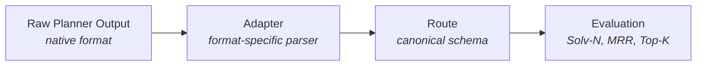
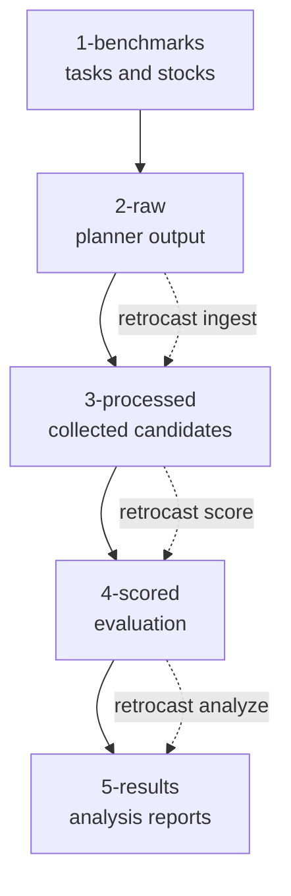

# Concepts and Architecture

RetroCast provides a standardized framework for evaluating retrosynthesis models. It addresses the fragmentation of planner output formats by separating model-specific parsing from evaluation logic.

!!! abstract "Core idea"

    **Adapters** translate native planner output into canonical `Route` objects. Once a planner output has been cast into this schema, scoring and analysis no longer need to know which model produced it.

## Adapters as the Boundary

Retrosynthesis planners produce different raw shapes. Some output bipartite molecule/reaction trees, some output route strings, some output precursor maps, and some output custom records from hosted APIs or LLM completions. Comparing those formats directly would mean rewriting evaluation logic for every planner.

RetroCast puts an adapter layer between raw output and evaluation:



The adapter handles the raw format. The evaluation pipeline handles canonical objects.

## Route

In [RetroCast schema](/dev/rationale/schema-design), a `Route` is a resolved AND/OR tree of `Molecule` and `Reaction` nodes.

```text
Route -> Molecule -> Reaction -> Molecule -> Reaction -> ...
```

The root is `Route.target`. A non-leaf `Molecule` has `product_of: Reaction`; a leaf molecule has `product_of = None`. A `Reaction` stores the reactant molecules used to make its product.

```python
class Molecule(BaseModel):
    smiles: SmilesStr
    inchikey: InChIKeyStr
    product_of: Reaction | None = None
    annotations: dict[str, Any] = Field(default_factory=dict)


class Reaction(BaseModel):
    reactants: list[Molecule]
    mapped_reaction_smiles: ReactionSmilesStr | None = None
    template: str | None = None
    reagents: list[SmilesStr] | None = None
    solvents: list[SmilesStr] | None = None
    annotations: dict[str, Any] = Field(default_factory=dict)


class Route(BaseModel):
    target: Molecule
    annotations: dict[str, Any] = Field(default_factory=dict)
    schema_version: str = "2"
```

Identical molecules in different route positions are different nodes. This keeps the route as a tree, which makes serialization, traversal, and route signatures straightforward. Chemical identity is still represented by InChIKey-derived molecule keys; node identity is route-local.

For the full design rationale, see [Schema Design](/dev/rationale/schema-design).

## Route-Local Node IDs

Evaluation artifacts sometimes need to point back into a route. RetroCast uses deterministic route-local ids for that:

- `rc:m:/` is the target molecule.
- `rc:r:/` is the reaction producing the target.
- `rc:m:/0` is the first reactant of the root reaction.
- `rc:r:/0` is the reaction producing `rc:m:/0`.
- `rc:m:/1/0` is a deeper molecule node.

These ids are addresses inside one route tree. They are not molecule identities and they are not serialized on `Molecule` or `Reaction` objects. Internally, code should use `RoutePath`; string ids are for artifacts, annotations, and UI boundaries.

See [Route Node IDs](dev/reference/route-node-ids.md) for the full grammar.

## Route Signatures

Route signatures are stable hashes over route structure. They let RetroCast compare routes without comparing nested Pydantic objects by hand.

Signatures are:

- order-invariant over reactant ordering.
- sensitive to multiplicity when the same reactant appears twice.
- parameterized by InChIKey match level when needed.
- usable at full-route, prefix-depth, reaction, and subtree levels.

This is the basis for deduplication, acceptable-route reconstruction, and structural comparisons across planner outputs.

## Candidate

`Route` is the chemistry tree. It should not carry planner rank or adaptation failure state.

For benchmarking, RetroCast needs to preserve every ranked prediction slot, including slots that failed adaptation. That is the role of `Candidate`:

```python
class FailureRecord(BaseModel):
    code: ErrorCode
    message: str | None = None
    target_id: str | None = None
    target_smiles: SmilesStr | None = None
    target_inchikey: InChIKeyStr | None = None
    context: dict[str, Any] = Field(default_factory=dict)


class Candidate(BaseModel):
    rank: int
    route: Route | None = None
    failure: FailureRecord | None = None
```

A `Candidate` contains either a valid `Route` or a `FailureRecord`, never both. This keeps Solv-0 denominators and MRR honest: an invalid first-ranked prediction is still a first-ranked prediction.

## Task and Benchmark

A `Task` defines what counts as solving the problem. It owns targets and task constraints.

```python
class Target(BaseModel):
    id: str
    smiles: SmilesStr
    inchikey: InChIKeyStr
    acceptable_routes: list[Route] = Field(default_factory=list)
    annotations: dict[str, Any] = Field(default_factory=dict)


class TaskConstraint(BaseModel):
    kind: str
    model_config = ConfigDict(extra="allow")


class StockTerminationConstraint(TaskConstraint):
    kind: Literal["retrocast.stock_termination"] = "retrocast.stock_termination"
    stock: str


class Task(BaseModel):
    name: str
    targets: dict[str, Target]
    default_constraints: list[TaskConstraint] = Field(default_factory=list)
    constraints: dict[str, list[TaskConstraint]] = Field(default_factory=dict)
    metric_label: str | None = None
    annotations: dict[str, Any] = Field(default_factory=dict)
    schema_version: str = "2"


class Benchmark(Task):
    description: str
```

One benchmark is a task. One ad hoc planning query can also be a task, usually with one target.

## Solv-N Evaluation

RetroCast separates chemical validity from task satisfaction.

```text
Solv-i[task] = Tier-i route validity + task constraint satisfaction
```

Tier validity asks whether the route and its reactions are chemically valid at a given level. Task constraints ask whether the route solves the user-defined problem, for example terminating in a stock, satisfying a depth bound, or containing a required leaf.

Those results are stored separately in `Evaluation`:

- `RouteValidity` stores route-level and reaction-level validity checks.
- `ConstraintResult` stores task-constraint checks.
- `ScoredCandidate` combines the original ranked candidate with validity, constraints, and acceptable-route matching.
- `TargetResult` groups scored candidates for one target.
- `Evaluation` groups all target results for one task.

See [Solv-N Evaluation](/dev/rationale/solv-n-evaluation) for the rationale behind the metric.

## Workflow

The schema-2 workflow is:

```text
adapt -> collect -> score -> analyze
```

`adapt` casts raw planner output into `Route`s or rank-preserving `Candidate`s.

`collect` maps adapted outputs onto known task targets.

`ingest` is a convenience alias for `adapt` + `collect`

`score` applies Tier-N validity checks and task constraints to produce an `Evaluation`.

`analyze` summarizes an `Evaluation` into rates, MRR@Solv-N, confidence intervals, and acceptable-route reconstruction metrics when acceptable routes exist.

## Data Organization

Project-mode commands use a structured data directory, by default `data/retrocast/`:



### 1. Benchmarks (`1-benchmarks/`)

Evaluation task definitions and stocks.

- `definitions/`: gzipped JSON benchmark/task files.
- `stocks/`: stock files used by task constraints.

### 2. Raw Data (`2-raw/`)

Read-only planner output.

- Structure: `2-raw/<model>/<benchmark>/<filename>`.
- Shape: planner-native and adapter-specific.
- Manifest: `manifest.json` declares the adapter and raw results filename.

### 3. Processed Data (`3-processed/`)

Generated by `retrocast ingest`.

- Primary artifact: `3-processed/<benchmark>/<model>/candidates.json.gz`.
- Shape: collected `Candidate`s keyed by target id.
- Purpose: preserve successful routes and failed prediction slots before scoring.

### 4. Scored Data (`4-scored/`)

Generated by `retrocast score`.

- Primary artifact: `4-scored/<benchmark>/<model>/<stock>/evaluation.json.gz`.
- Shape: `Evaluation`.
- Purpose: store per-candidate validity, task-constraint results, and acceptable-route matching.

### 5. Results (`5-results/`)

Generated by `retrocast analyze`.

- Primary artifact: `5-results/<benchmark>/<model>/<stock>/analysis.json.gz`.
- Report: `5-results/<benchmark>/<model>/<stock>/report.md`.
- Shape: `AnalysisReport` plus a rendered markdown summary.

## Artifact Shape Reference

| Stage | File | Stored shape | Notes |
| --- | --- | --- | --- |
| `1-benchmarks` | `definitions/<benchmark>.json.gz` | `Benchmark` | Targets, acceptable routes, default constraints, and per-target constraints. |
| `1-benchmarks` | `stocks/<stock>` | text or curated stock artifact | Available starting materials used by stock constraints. |
| `2-raw` | provider result file | adapter-native | Read-only model output. RetroCast does not impose a schema here. |
| `2-raw` | `manifest.json` | manifest with adapter directives | Declares how to read the raw file. |
| `3-processed` | `candidates.json.gz` | `dict[str, list[Candidate]]` | Collected candidates keyed by target id; preserves failed prediction slots. |
| `4-scored` | `evaluation.json.gz` | `Evaluation` | Scored candidates plus target-level task context. |
| `5-results` | `analysis.json.gz` | `AnalysisReport` | Metric summaries, confidence intervals, and optional strata. |
| `5-results` | `report.md` | markdown | Human-readable report generated from `AnalysisReport`. |

## Provenance and Verification

RetroCast writes manifests next to generated artifacts. A manifest records:

1. the command or workflow action that generated the artifact
2. input paths and hashes
3. output paths and hashes
4. parameters such as model, benchmark, stock, adapter, and truncation limits
5. workflow statistics, such as failure counts by error code

The `retrocast verify` command checks manifest lineage and file integrity.

Verification has two parts:

- Manifest-chain consistency: generated artifacts should point back to the inputs declared by their parent manifests.
- On-disk integrity: files should still match the hashes recorded in their manifests.

This helps detect corrupted files, stale derived artifacts, manual edits, and out-of-order workflow steps.
