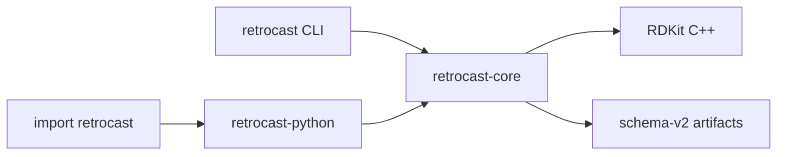

# Rust core architecture

RetroCast is a Rust library with two front ends: a standalone command and a Python package. This is an ownership decision, not an optimization mode. The Rust core owns the schemas, chemistry, adapters, workflows, artifact I/O, and parallel execution. Python exposes those capabilities without reimplementing them.

!!! note "Port contract"

    This document defines the architectural boundary and the release gate. A production path moves to Rust only after equivalence tests pass. Cross-platform release jobs must still pass for each published version; source code and local tests alone cannot certify a Windows, Linux, or macOS artifact.

The schema contract in [Schema Design](schema-design.md) is authoritative for both front ends.

## Why one core

The earlier native slice accelerated AiZynthFinder ingest, score, and analysis behind the existing Python implementation. It proved that the work benefits from native execution, but it left two owners for the same behavior. Python still selected adapters, reconstructed Pydantic objects between stages, and wrote artifacts. The standalone binary and `import retrocast` could therefore disagree even when both claimed to use Rust.

The full port removes that split. A value created by an adapter remains the same Rust value through scoring and analysis. Serialization happens only when the user asks to read or write an artifact. The CLI and Python bindings cannot develop different workflow semantics because neither contains workflow logic.

## Workspace shape

The published package lives under `retrocast-rs`. Its Python source is the facade over the PyO3 extension, so the wheel and the standalone executable are built from one implementation tree. The root `pyproject.toml` coordinates that mixed-language build.

```text
packages/
├── retrocast-py/
│   ├── src/retrocast/        frozen pure-Python v0.7.1 oracle
│   ├── tests/                frozen v0.7.1 tests
│   └── pyproject.toml        independent, non-release environment
└── retrocast-rs/
    ├── crates/
    │   ├── retrocast-core/   schemas, chemistry, adapters, I/O, workflows
    │   ├── retrocast-cli/    argument parsing and terminal presentation
    │   └── retrocast-python/ PyO3 types and Python-callable functions
    ├── python/retrocast/     published Python facade
    ├── tests/                Python API and cross-language contracts
    └── Cargo.toml
```

`retrocast-py` preserves the `v0.7.1` implementation as a differential-testing oracle while the Rust port is battle-tested. It is not published and does not receive features or fixes. Both implementations expose the `retrocast` import namespace, so parity checks run them in separate environments.

`retrocast-core` is an ordinary Rust library. It does not import PyO3 or Clap. That keeps the domain model usable from other Rust programs and makes the core testable without starting Python or a process.

`retrocast-cli` builds the `retrocast` executable. It resolves paths and flags, calls the core, and presents errors. It does not parse planner payloads or calculate metrics itself.

The executable exposes the workflow stages directly:

```console
retrocast adapt --input raw.json.gz --adapter synplanner --output candidates.json.gz
retrocast ingest --input raw.json.gz --adapter synplanner --benchmark task.json.gz --output predictions.json.gz
retrocast score --candidates predictions.json.gz --benchmark task.json.gz --stock stock.csv.gz --output evaluation.json.gz
retrocast analyze --evaluation evaluation.json.gz --output analysis.json.gz
```

`retrocast pipeline` chains the last three stages without writing and re-reading the intermediate Rust values. `--adapter` resolves through the same built-in registry used by the Python binding.

`retrocast-python` builds `retrocast._native`. It converts Python arguments at the boundary and returns Python views over Rust-owned values. It does not route work back through the Python implementation.



The dependency arrows only point inward. In particular, `retrocast-core` never depends on either front end.

## Front-end scope

The word _port_ applies to behavior that defines a RetroCast result: schema validation, chemistry, adaptation, collection, scoring, statistics, analysis, artifact I/O, dataset selection, curation, and provenance. Both front ends call that behavior in `retrocast-core`.

Front ends still own interaction with their host. Clap owns standalone argument parsing and terminal messages. Pydantic exposes familiar Python objects after a caller inspects a native value. Rich and Plotly can render Markdown, tables, or an optional Pareto chart from a core-produced `AnalysisReport`. Those renderers may differ without creating a second engine because they cannot alter the report.

The standalone executable covers all engine and data-management commands: `adapt`, `collect`, `ingest`, `score`, `analyze`, `pipeline`, `verify`, `get-data`, `get-training-data`, `config`, `list`, and `list-adapters`. `compare pareto-frontier` remains an optional Python visualization command; it reads analysis artifacts and writes HTML, but owns no evaluation or comparison metric.

## Data ownership

The core owns `Route`, `Candidate`, `Task`, `Evaluation`, and `AnalysisReport`. Workflow functions take and return those types directly:

```rust
let candidates = ingest(raw, &task, &adapter, &ingest_options)?;
let evaluation = score(&candidates, &task, &registry, &score_options)?;
let report = analyze(&evaluation, &analysis_options)?;
```

Python presents equivalent calls:

```python
candidates = retrocast.ingest(raw, task, adapter="aizynthfinder")
evaluation = retrocast.score(candidates, task, registry=registry)
report = retrocast.analyze(evaluation)
```

The Python variables above wrap the Rust values. Passing `candidates` into `score` does not serialize JSON and does not reconstruct a parallel Pydantic tree. `model_dump()` and artifact writers materialize Python or JSON data only when requested.

The compatibility views are deliberately one-way. Their first field, mapping, or mutation access materializes the Python DTO and discards the opaque handle. An untouched value can be handed to the next native stage; an inspected value takes the validated DTO path. RetroCast never tries to detect arbitrary nested Python mutations and never runs a later stage against a stale native copy.

Workflow statistics follow the same rule. Candidate counts, failure distributions, timing summaries, and Solv counts are computed against the Rust value. Requesting them does not materialize an otherwise untouched prediction or evaluation.

This boundary establishes three invariants:

- a schema has one validator and one set of defaults
- stage chaining does not serialize intermediate values
- the CLI and Python library produce the same artifact for the same inputs and options

### Artifact boundaries

An artifact path crosses the Python binding as a path, not as its contents. Rust opens the compressed file and deserializes it directly into the type consumed by that stage. Writing an opaque prediction or evaluation calls the Rust writer against the same native value. The Python process does not construct a dictionary, JSON string, or Pydantic graph for these operations.

Project-mode commands follow this ownership sequence:

    compressed raw file
      -> Rust provider payload
      -> Rust Predictions
      -> Rust Evaluation
      -> small AnalysisReport returned for presentation

Each arrow consumes the previous corpus-sized value when the previous value is no longer needed. Scoring moves candidates into the evaluation. The pipeline writes predictions before that move and writes the evaluation before analysis releases it. Manifest generation hashes the written artifacts and receives only small statistics; it does not convert a typed artifact into a second generic JSON tree.

The in-memory Python API accepts dictionaries and Pydantic models for compatibility. Those calls must serialize caller-owned Python values because Python already owns the input. Project-mode stage commands and `pipeline` are the normal large-corpus path and never take that detour. The invariant is one corpus-sized representation per active stage, plus bounded input, output, and worker-local buffers.

## Extensibility boundary

Adapters, tier checkers, constraint checkers, and analysis strata are Rust traits. Built-in implementations are registered by stable string identifiers. A configuration artifact refers to an implementation by identifier rather than containing executable Python.

Python callbacks are useful for exploration, but calling Python once per route would reacquire the GIL and make execution behavior depend on the front end. They therefore live at an explicit interoperability boundary. A Python callback checker can be offered as a compatibility adapter, but it is not available to the standalone CLI and is never selected implicitly. Production extensions are Rust plugins or contributions to the built-in registry.

## RDKit boundary

Canonical SMILES, InChIKeys, heavy-atom counts, exact molecular weights, and assigned stereocenter counts are calculated through a narrow C++ bridge to RDKit. The bridge accepts owned text and returns owned scalar values or an owned error. No RDKit object, Boost type, or C++ allocation crosses into a public Rust or Python API.

This narrow boundary is intentional. RDKit does not provide a stable C++ ABI for exchanging its objects between independently built libraries. Each release artifact therefore ships with the RDKit libraries against which it was linked, and the Python API never accepts an object from `rdkit.Chem` as a native handle. The wheel does not depend on the Python `rdkit` package.

Chemistry operations have typed Rust entry points over that bridge:

```rust
pub fn canonicalize(
    smiles: &str,
    remove_mapping: bool,
    ignore_stereo: bool,
) -> Result<CanonicalSmiles>;

pub fn inchi_key(smiles: &str, level: InchiKeyLevel) -> Result<String>;
pub fn descriptors(smiles: &str) -> Result<MolecularDescriptors>;
```

The release implementation is RDKit C++. Public Python chemistry helpers translate native errors into RetroCast's stable exception types; they do not perform chemistry themselves.

## Parallel execution

Parallelism belongs to the core because the core knows the safe unit of work. Ingest and score partition by target. Analysis partitions independent metric or bootstrap groups. A bounded worker pool is created from `workers`; output is collected into ordered maps before serialization.

Adapter entries must contain only the data needed to cast that candidate. A provider may supply a shared search graph, but copying that complete graph into every route entry makes worker count multiply corpus memory. The adapter first narrows shared provider state to a route-local entry, then parallel workers cast those entries.

Determinism does not mean preserving completion order. It means that worker count cannot change target order, candidate rank, signatures, point estimates, or seeded confidence intervals.

The Python binding releases the GIL for a core operation. It does not create a Python process pool. `workers=12` therefore means the same thing from Python and from the standalone command.

## Distribution

The project publishes two forms of the same core:

- Python wheels contain `retrocast._native`, its repaired RDKit C++ libraries, and the small Python compatibility layer. `pip install retrocast` needs no Rust compiler, separate RDKit installation, or Python `rdkit` package.
- standalone archives contain the `retrocast` executable and its required native libraries. They can also feed package managers such as Homebrew, Scoop, and winget.

Release automation builds and smoke-tests Windows x86-64, Linux x86-64, macOS arm64, and macOS x86-64 artifacts. Native dependencies are repaired into the wheel or CLI bundle for each platform. Source builds remain available for other targets and require Rust, a C++20 compiler, Boost headers, and RDKit C++.

Linux wheels build the pinned RDKit release from source with the manylinux toolchain. This avoids inheriting Conda's newer `libstdc++` baseline while still calling the same C++ API; RetroCast does not import or install the Python `rdkit` package at runtime.

The Python wheel and standalone archive for one release are built from the same workspace revision and report the same RetroCast and RDKit versions.

## Regression rule

Frozen Python-era artifacts and property tests remain regression inputs, not an alternate runtime. A Rust module replaces its former Python implementation only after those fixtures establish schema and behavioral equivalence; the replaced implementation is then removed rather than retained as a fallback.

There is no `engine="python"` or `engine="rust"` selector. Benchmarks labeled `python-api` measure the Python front end calling the Rust core, including Python startup and final DTO/artifact materialization. They do not invoke a second engine.

## Done condition

The port is complete when all of the following are true:

- every public workflow executes in `retrocast-core`
- the standalone CLI covers every engine and data-management command exposed by the Python CLI
- `import retrocast` calls the same core without JSON between stages
- schema-v2 artifacts round-trip and remain compatible with existing data
- built-in adapters, constraints, metrics, provenance, and verification have cross-language regression coverage
- wheels and standalone bundles pass clean-machine smoke tests on all release platforms
- the Python reference implementation is no longer on a production code path

Performance is measured after these invariants hold. A faster partial port is useful evidence, but it is not the architecture.
