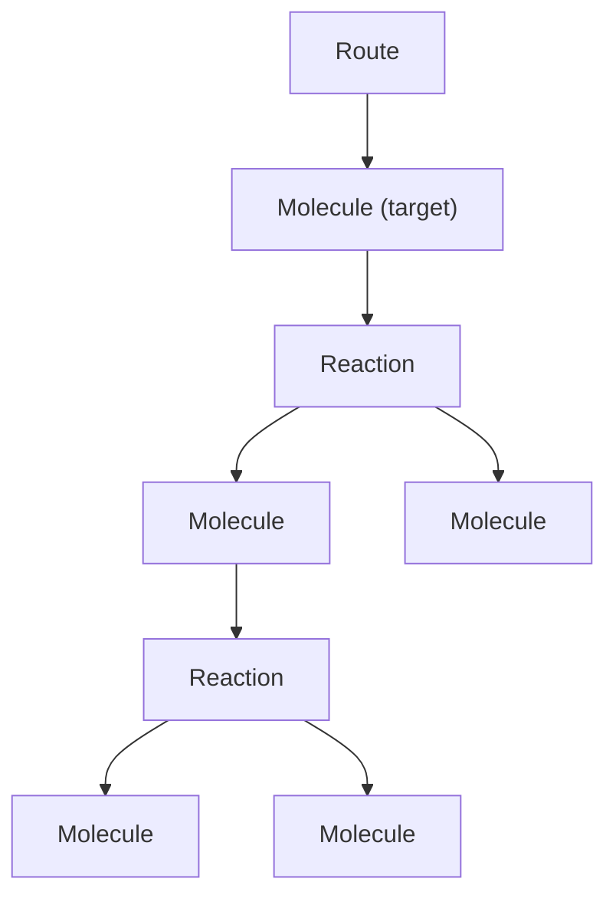
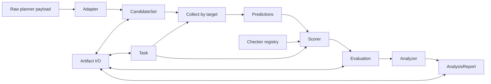

# Schema Design

This document captures the thinking process for the core data model and workflow design in RetroCast. It is a more elaborate version of the [concepts overview page](/concepts) and is the primary place to build a mental model of the codebase.

## Goals

RetroCast is designed to handle two broad use cases:

- casting arbitrary planner output into canonical `Route`s
- evaluating those outputs for one target or many targets

## Implementation ownership

The schema has one production implementation: `retrocast-core`. The standalone command and the Python extension are front ends over the same Rust values. They own argument conversion and presentation; they do not implement adapters, chemistry, scoring, or analysis.

```text
packages/retrocast-rs/
├── crates/retrocast-core/     schemas, RDKit bridge, adapters, workflows, I/O
├── crates/retrocast-cli/      standalone command
└── crates/retrocast-python/   direct PyO3 module named retrocast
```

The frozen `packages/retrocast-py` tree preserves the v0.7.1 implementation for differential testing. It is not imported by the native package and is not a fallback engine.

The two public entry points express the same operation at their host-language boundary:

=== "Python 0.8.x"

    ```python
    predictions = retrocast.ingest(raw, "aizynthfinder", task)
    evaluation = retrocast.score(predictions, task, stocks)
    report = retrocast.analyze(evaluation)
    ```

=== "Rust 0.8.x"

    ```rust
    let predictions = ingest(raw, adapter, &task, mode, limit, workers)?;
    let evaluation = score_owned(
        predictions,
        task,
        &stocks,
        match_level,
        acceptable_route_match,
        execution_stats,
        workers,
    )?;
    let report = analyze(&evaluation, &ks, &prefix_depths, n_boot, seed, workers)?;
    ```

=== "Python 0.7.1"

    ```python
    adapter = get_adapter("aizynthfinder")
    predictions = ingest_candidates(raw, adapter, task)
    evaluation = score(predictions, task, constraint_checkers=checkers)
    report = analyze(evaluation)
    ```

This establishes three invariants: schemas have one validator, in-process stage chaining does not serialize intermediate artifacts, and worker count cannot change serialized results.

## Route

In RetroCast, a `Route` is an AND/OR tree of `Molecule` and `Reaction` nodes.

```text
Route -> Molecule -> Reaction -> Molecule -> Reaction -> ...
```



Basic schema

=== "Python 0.8.x"

    ```python
    report = retrocast.analyze(
        evaluation,
        ks=[1, 5, 10, 50],
        prefix_depths=[1, 2, 3],
        n_boot=10_000,
        seed=42,
        workers=12,
    )
    ```

=== "Rust 0.8.x"

    ```rust
    #[derive(Clone, Debug, Deserialize, Serialize)]
    pub struct Molecule {
        pub smiles: CanonicalSmiles,
        pub inchikey: InchiKey,
        pub product_of: Option<Box<Reaction>>,
        #[serde(default)]
        pub annotations: serde_json::Map<String, Value>,
    }

    #[derive(Clone, Debug, Deserialize, Serialize)]
    pub struct Reaction {
        pub reactants: Vec<Molecule>,
        pub mapped_reaction_smiles: Option<ReactionSmiles>,
        pub template: Option<String>,
        pub reagents: Option<Vec<CanonicalSmiles>>,
        pub solvents: Option<Vec<CanonicalSmiles>>,
        #[serde(default)]
        pub annotations: serde_json::Map<String, Value>,
    }

    #[derive(Clone, Debug, Deserialize, Serialize)]
    pub struct Route {
        pub target: Molecule,
        #[serde(default)]
        pub annotations: serde_json::Map<String, Value>,
        #[serde(default = "schema_version")]
        pub schema_version: SchemaVersion,
    }
    ```

=== "Python 0.7.1"

    ```python
    class Molecule(BaseModel):
        smiles: SmilesStr
        inchikey: InChIKeyStr
        product_of: Reaction | None = None
        annotations: dict[str, Any] = Field(default_factory=dict)


    class Reaction(BaseModel):
        reactants: list[Molecule]
        mapped_reaction_smiles: ReactionSmilesStr | None = None
        template: str | None = None
        reagents: list[SmilesStr] | None = None
        solvents: list[SmilesStr] | None = None
        annotations: dict[str, Any] = Field(default_factory=dict)


    class Route(BaseModel):
        target: Molecule
        annotations: dict[str, Any] = Field(default_factory=dict)
        schema_version: str = "2"
    ```

`CanonicalSmiles`, `InchiKey`, and `SchemaVersion` are validated Rust newtypes rather than aliases for `String`. Serde deserialization calls their validation path, so loading an artifact cannot bypass the constraints used by adapters.

Identical molecules in different positions (e.g. same building block used in two branches) are different nodes; whence a Route is a tree, not just a DAG. Primarily because enforcing a 1 molecule = 1 node would introduce operational (serialization, signatures) complexity without any clear/obvious benefit beyond just marginally smaller disk usage.

### Route path

RetroCast uses deterministic paths to refer to molecules and reactions inside a `Route`. The full grammar lives in [Route Node IDs](../reference/route-node-ids.md); but here's a useful cheat sheet:

- `rc:m:/` root target molecule
- `rc:r:/` root reaction
- `rc:m:/0` first reactant under `rc:r:/`
- `rc:r:/0` reaction producing `rc:m:/0`
- `rc:m:/1/0` first child under `rc:m:/1`

These IDs are derived in memory and are not serialized. Internally, they are typed addresses, not strings that each caller reparses.

=== "Python 0.8.x"

    ```python
    predictions.write("candidates.json.gz")
    manifest = json.loads(
        retrocast.create_manifest_json(json.dumps(manifest_request))
    )
    ```

=== "Rust 0.8.x"

    ```rust
    #[derive(Clone, Debug, Eq, Hash, PartialEq)]
    pub enum RoutePath {
        Molecule(Box<[usize]>),
        Reaction(Box<[usize]>),
    }

    impl RoutePath {
        pub fn parse(value: &str) -> Result<Self, RoutePathError>;
        pub fn target() -> Self;
        pub fn root_reaction() -> Self;
        // RoutePath implements Display and serializes to the same rc:* string.
        pub fn depth(&self) -> usize;
        pub fn produced_by(&self) -> Result<Self, RoutePathError>;
        pub fn product(&self) -> Result<Self, RoutePathError>;
        pub fn reactant(&self, index: usize) -> Result<Self, RoutePathError>;
    }
    ```

=== "Python 0.7.1"

    ```python
    @dataclass(frozen=True)
    class RoutePath:
        kind: Literal["m", "r"]
        indices: tuple[int, ...] = ()

        @classmethod
        def parse(cls, value: str) -> RoutePath: ...

        @classmethod
        def target(cls) -> RoutePath: ...

        @classmethod
        def root_reaction(cls) -> RoutePath: ...

        def id(self) -> str: ...
        def depth(self) -> int: ...
        def produced_by(self) -> RoutePath: ...
        def product(self) -> RoutePath: ...
        def reactant(self, index: int) -> RoutePath: ...
    ```

semantics:

- `RoutePath.target()` is `rc:m:/`
- `RoutePath.root_reaction()` is `rc:r:/`
- `RoutePath.parse("rc:m:/1/0").produced_by()` is `rc:r:/1/0`
- `RoutePath.parse("rc:r:/1/0").product()` is `rc:m:/1/0`
- `RoutePath.parse("rc:r:/1/0").reactant(2)` is `rc:m:/1/0/2`

For serialized IDs, Python exposes validated strings and Rust exposes newtypes:

=== "Python 0.8.x"

    The binding exposes this Rust-owned value as JSON-compatible Python data.
    Validation and derived behavior stay in `retrocast-core`; 0.8.x defines no
    parallel Python model for it.

=== "Rust 0.8.x"

    ```rust
    #[derive(Clone, Debug, Deserialize, Eq, Hash, Serialize)]
    #[serde(try_from = "String", into = "String")]
    pub struct ReactionId(RoutePath);

    #[derive(Clone, Debug, Deserialize, Eq, Hash, Serialize)]
    #[serde(try_from = "String", into = "String")]
    pub struct MoleculeId(RoutePath);
    ```

=== "Python 0.7.1"

    ```python
    ReactionId = Annotated[str, AfterValidator(validate_reaction_id)]
    MoleculeId = Annotated[str, AfterValidator(validate_molecule_id)]
    ```

An invalid kind is rejected when the ID enters the core. Downstream scoring code cannot accidentally put a molecule address into `ReactionValidity`.

## Route Signatures

`Route` signatures give us a canonical way to talk about route structure without carrying around the whole tree or comparing nested objects by hand. They are the basis for route comparison: full-route equality, reaction equality, prefix matching to depth `k`, and subtree containment. The core idea is [Merkle-like](https://en.wikipedia.org/wiki/Merkle_tree): the signature of a parent is built from its own identity plus the signatures of its children. Signatures are:

- order-invariant over reactant ordering
- preserve multiplicity when the same reactant appears more than once
- and can be parameterized by match level when needed.

### Molecule Identity

We use [InChiKeys](https://en.wikipedia.org/wiki/International_Chemical_Identifier) as molecular identity. RetroCast currently supports three levels of InChiKey specificity:

- `retrocast.chem.InChIKeyLevel.FULL` - full 27-char InChIKey
- `retrocast.chem.InChIKeyLevel.NO_STEREO` - 27-char InChIKey generated without stereochemical information
- `retrocast.chem.InChIKeyLevel.CONNECTIVITY` - first 14 chars, connectivity layer only

Most users should use the default `FULL` level, but sometimes a model developer might wish to disambiguate planner's failure to account for proper stereochemistry from more fundamental failures to find the right connectivity (wherefore he might use `NO_STEREO`). Or might want to ignore isotope/protonation differences (wherefore `CONNECTIVITY`).

```python
class Molecule(BaseModel):
    ...

    def key(self, match_level: InChIKeyLevel = InChIKeyLevel.FULL) -> str:
        return reduce_inchikey(self.inchikey, match_level)
    def signature(self, match_level: InChIKeyLevel = InChIKeyLevel.FULL) -> str:
        return stable_hash(self.key(match_level))
```

### Reaction Identity

At the most basic structural level, a reaction identity is defined by the structures of reactants and product. Defining `key` and `signature` method on a `Reaction` class is not possible without having a pointer to the `Reaction` product. There are two options:

- treat `Reaction` as a Route-specific occurrence object (with an explicit pointer to its product), but that requires writing custom serialization logic and ensuring loaded Reaction objects are always "hydrated" with proper parent references. Violates the spirit of [SRP](https://en.wikipedia.org/wiki/Single-responsibility_principle) and I'm a bit WebDev-brained not to think of the Data-View split analogy, so instead
- we create a `ReactionView` model that provides a required route-contextual representation of a `Reaction`.

=== "Python 0.8.x"

    The binding exposes this Rust-owned value as JSON-compatible Python data.
    Validation and derived behavior stay in `retrocast-core`; 0.8.x defines no
    parallel Python model for it.

=== "Rust 0.8.x"

    ```rust
    pub struct ReactionView<'route> {
        pub route: &'route Route,
        pub path: RoutePath,
        pub value: &'route Reaction,
    }

    impl ReactionView<'_> {
        pub fn product(&self) -> MoleculeView<'_>;
        pub fn reactants(&self) -> Vec<MoleculeView<'_>>;
        pub fn key(&self, level: InchiKeyLevel) -> ReactionKey;
        pub fn signature(&self, level: InchiKeyLevel) -> Signature;
    }
    ```

=== "Python 0.7.1"

    ```python
    class ReactionView:
        route: Route
        path: RoutePath
        value: Reaction

        def product(self) -> MoleculeView: ...
        def reactants(self) -> list[MoleculeView]: ...
        def key(self, match_level=InChIKeyLevel.FULL) -> tuple: ...
        def signature(self, match_level=InChIKeyLevel.FULL) -> str: ...
    ```

for consistency in api design and ease of subtree comparison, we also define a similar view model for `Molecule`.

=== "Python 0.8.x"

    The binding exposes this Rust-owned value as JSON-compatible Python data.
    Validation and derived behavior stay in `retrocast-core`; 0.8.x defines no
    parallel Python model for it.

=== "Rust 0.8.x"

    ```rust
    pub struct MoleculeView<'route> {
        pub route: &'route Route,
        pub path: RoutePath,
        pub value: &'route Molecule,
    }

    impl MoleculeView<'_> {
        pub fn key(&self, level: InchiKeyLevel) -> MoleculeKey;
        pub fn produced_by(&self) -> Option<ReactionView<'_>>;
        pub fn subtree_key(&self, level: InchiKeyLevel, depth: Option<usize>) -> SubtreeKey;
        pub fn subtree_signature(&self, level: InchiKeyLevel, depth: Option<usize>) -> Signature;
    }
    ```

=== "Python 0.7.1"

    ```python
    class MoleculeView:
        route: Route
        path: RoutePath
        value: Molecule

        def key(self, match_level=InChIKeyLevel.FULL) -> str: ...
        def produced_by(self) -> ReactionView | None: ...
        def subtree_key(self, match_level=InChIKeyLevel.FULL, *, depth=None) -> tuple: ...
        def subtree_signature(self, match_level=InChIKeyLevel.FULL, *, depth=None) -> str: ...
    ```

Rust views borrow the route. They cannot outlive it and they do not introduce parent pointers into the serialized tree.

### Route Identity

With the primitives above, full route equality is established by the subtree signature of the target with unlimited depth. i.e. `route.signature()` is an alias for `route.molecule_at("rc:m:/").subtree_signature()`. A generic exact subtree equality is `route.molecule_at(path).subtree_signature()`.

We often might be interested in asking how far along the plan (starting from the target) do any two Routes agree? Such prefix matching is simply a subtree signature of fixed depth `k` rooted at the target.

=== "Python 0.8.x"

    The binding exposes this Rust-owned value as JSON-compatible Python data.
    Validation and derived behavior stay in `retrocast-core`; 0.8.x defines no
    parallel Python model for it.

=== "Rust 0.8.x"

    ```rust
    impl Route {
        pub fn key(&self, level: InchiKeyLevel, depth: Option<usize>) -> SubtreeKey;
        pub fn signature(&self, level: InchiKeyLevel, depth: Option<usize>) -> Signature;
    }
    ```

=== "Python 0.7.1"

    ```python
    route.key(match_level=InChIKeyLevel.FULL, depth=None) -> tuple
    route.signature(match_level=InChIKeyLevel.FULL, depth=None) -> str
    ```

### Content Signatures

The structural `key` / `signature` methods answer the basic route question: same molecules, same reaction graph. They do not read mapped reaction SMILES, templates, reagents, solvents, condition labels, or annotations.

Sometimes we want a stricter comparison: same structure, plus selected reaction content. For that, routes and route-bound views expose `content_key` / `content_signature` methods. The caller chooses which reaction fields matter:

```python
route.content_signature(fields=("mapped_reaction_smiles",))
route.content_signature(fields=("template", "reagents", "solvents"))
```

Content signatures follow the same Merkle shape as structural signatures: molecule identity, reaction identity, selected reaction content, and unordered child signatures. They also support `match_level` and route-prefix `depth`.

### Route Embedding

Route embedding asks whether one route occurs inside another route.

`Route.signature()` and `MoleculeView.subtree_signature()` answer exact equality for a chosen root. Embedding is looser in two ways: the query target may match an internal molecule in the container route, and the container may continue below a query leaf when the audit allows leaf extension.

`retrocast.curation.embedding` uses route views, paths, molecule keys, reaction signatures, and subtree signatures to produce audit traces:

=== "Python 0.8.x"

    The binding exposes this Rust-owned value as JSON-compatible Python data.
    Validation and derived behavior stay in `retrocast-core`; 0.8.x defines no
    parallel Python model for it.

=== "Rust 0.8.x"

    ```rust
    pub struct EmbeddingMatch {
        pub query_path: RoutePath,
        pub container_path: RoutePath,
        pub matched_reactions: usize,
        pub leaf_extensions: Vec<LeafExtension>,
    }

    pub fn find_route_embeddings(
        query: &Route,
        container: &Route,
        options: &EmbeddingOptions,
    ) -> Vec<EmbeddingMatch>;

    pub fn route_embeds_at(
        query: MoleculeView<'_>,
        container: MoleculeView<'_>,
        options: &EmbeddingOptions,
    ) -> Option<EmbeddingMatch>;
    ```

=== "Python 0.7.1"

    ```python
    class EmbeddingMatch:
        query_path: RoutePath
        container_path: RoutePath
        matched_reactions: int
        leaf_extensions: tuple[LeafExtension, ...]

    find_route_embeddings(query, container, *, allow_leaf_extension=True) -> tuple[EmbeddingMatch, ...]
    route_embeds_at(query_view, container_view, *, allow_leaf_extension=True) -> EmbeddingMatch | None
    ```

The detailed matching rules live in [Route Embedding](../reference/route-embedding.md). The important schema-design point is small: exact subtree equality is a signature check; embedding is a route-to-route matching check.

## Ownership and data flow

The public Python API and the standalone command execute the same functions in `retrocast-core`. Python names below are views over Rust-owned values; they are not a second set of workflow models.



Each arrow is a concrete read/write boundary:

| Stage | Reads | Writes | Invariant established |
| --- | --- | --- | --- |
| Load | bytes and artifact kind | validated schema value | invalid serialized states stop here |
| Adapt | planner payload and adapter options | ranked `Candidate`s | every raw rank becomes exactly one route or failure |
| Collect | candidates and task target index | target-keyed predictions | every candidate belongs to a known target |
| Score | predictions, task, checker registry | `Evaluation` | requested checks and effective constraints are recorded |
| Analyze | evaluation and metric options | `AnalysisReport` | every metric records its denominator and reliability |
| Write | any artifact value | bytes plus manifest metadata | content hash covers the serialized artifact |

No workflow serializes an intermediate value to call the next workflow. Artifact I/O is a leaf operation at the edge of the graph. A single `retrocast evaluate` invocation keeps each target's routes as Rust values until it has scored them and prepared their analysis contributions.

Standalone evaluation applies the same ownership target by target. A route moves directly from adaptation into scoring; the worker then writes that target's candidate and evaluation output fragments and reduces the scored route to scalar analysis contributions. The sorted fragments are final artifact-writer state and are never read back to invoke scoring or analysis.

The standalone Rust entry point uses the same target-owned evaluation as the CLI:

```rust
let stats = retrocast_core::evaluate::evaluate_files(
    raw_path,
    benchmark_path,
    stock_path,
    stock_name,
    execution_stats_path,
    output_dir,
    &options,
)?;
```

The core API reflects that ownership:

=== "Python 0.8.x"

    ```python
    candidates = retrocast.ingest(raw, "aizynthfinder", task)
    evaluation = retrocast.score(candidates, task, stocks)
    report = retrocast.analyze(evaluation)
    ```

=== "Rust 0.8.x"

    ```rust
    let candidates = ingest(raw, adapter, &task, mode, limit, workers)?;
    let evaluation = score_owned(
        candidates,
        task,
        &stocks,
        match_level,
        acceptable_route_match,
        execution_stats,
        workers,
    )?;
    let report = analyze(&evaluation, &ks, &prefix_depths, n_boot, seed, workers)?;
    ```

=== "Python 0.7.1"

    ```python
    candidates = ingest_candidates(raw, adapter, task)
    evaluation = score(candidates, task, constraint_checkers=checkers)
    report = analyze(evaluation)
    ```

The Python 0.8.x and Rust 0.8.x values have the same owner: `retrocast-core`. Python 0.7.1 constructs an independent Pydantic graph at each stage.

## Workflows

Raw planner payloads can be `adapt`ed into `Route` objects, which constitute fully Tier-0 valid routes, or `Candidate` objects, which preserve failed slots for proper accounting of Solv-0. Canonical `Candidates` can be `collect`ed into predictions for each `Target`/`Task`. A collection of `Task`s is a `Benchmark`.

Direct `adapt`ing is useful for one target. Benchmark evaluation uses `ingest`, which combines `adapt` and `collect` into predictions keyed by benchmark target.

`Benchmark` predictions are keyed by target id. These predictions can be `score`d with Tier-N validity checks against `TaskConstraint` records, resulting in Solv-N values. Predictions can also be compared against `Target.acceptable_routes` to obtain Top-K reconstruction accuracy.

## 1. Adapt

By default, adapt tries to turn raw planner output into canonical `Route` objects and if fails, returns None. While it's a reasonable default for regular planning, it inflates the Tier-0 validity of the planner's predictions for strict benchmarking. As such, `adapt` can be configured to return `Candidate` objects which either hold a `Route` or a `FailureRecord` that specifies `target_{id,smiles,inchikey}` for proper accounting of failed predictions.

=== "Python 0.8.x"

    The binding exposes this Rust-owned value as JSON-compatible Python data.
    Validation and derived behavior stay in `retrocast-core`; 0.8.x defines no
    parallel Python model for it.

=== "Rust 0.8.x"

    ```rust
    #[derive(Clone, Debug, Deserialize, Serialize)]
    pub struct FailureRecord {
        pub code: String,
        pub message: Option<String>,
        pub target_id: Option<String>,
        pub target_smiles: Option<CanonicalSmiles>,
        pub target_inchikey: Option<InchiKey>,
        #[serde(default)]
        pub context: serde_json::Map<String, Value>,
    }

    #[derive(Clone, Debug, Serialize)]
    pub struct Candidate {
        pub rank: usize,
        pub route: Option<Route>,
        pub failure: Option<FailureRecord>,
    }
    ```

=== "Python 0.7.1"

    ```python
    class FailureRecord(BaseModel):
        code: ErrorCode
        message: str | None = None
        target_id: str | None = None
        target_smiles: SmilesStr | None = None
        target_inchikey: InChIKeyStr | None = None
        context: dict[str, Any] = Field(default_factory=dict)


    class Candidate(BaseModel):
        rank: int
        route: Route | None = None
        failure: FailureRecord | None = None
    ```

Custom deserialization validates that rank is at least one and exactly one of `route` or `failure` is present. Adapters and artifact readers therefore establish the same invariant.

### Adapt modes

By default, `adapt` returns a `FailureRecord` if even a single SMILES is invalid. Model developers might sometimes be interested in the validity of predictions up to the corrupted SMILES, and `AdaptMode` allows them to relax adapters to return `Route`/`Candidate` objects that contain the longest-possible valid prefix `Route` with the corrupted SMILES node and all its children pruned out.

=== "Python 0.8.x"

    The binding exposes this Rust-owned value as JSON-compatible Python data.
    Validation and derived behavior stay in `retrocast-core`; 0.8.x defines no
    parallel Python model for it.

=== "Rust 0.8.x"

    ```rust
    #[derive(Clone, Copy, Debug, Eq, PartialEq)]
    pub enum AdaptMode {
        Strict,
        Prune,
    }
    ```

=== "Python 0.7.1"

    ```python
    AdaptMode = Literal["strict", "prune"]
    ```

### Adapt API

=== "Python 0.8.x"

    ```python
    retrocast.adapt(
        raw_payload,
        adapter_name,
        *,
        mode="strict",
        target=None,
        source_key=None,
        max_candidates=None,
        workers=1,
    ) -> list[dict]
    ```

=== "Rust 0.8.x"

    ```rust
    pub trait Adapter: Send + Sync {
        fn name(&self) -> &'static str;

        fn entries(
            &self,
            payload: serde_json::Value,
            source_key: Option<&str>,
        ) -> Result<Vec<RawRouteEntry>>;

        fn cast(
            &self,
            raw_route: serde_json::Value,
            mode: AdaptMode,
            target: Option<&Target>,
        ) -> Result<Route>;
    }

    pub fn adapt_candidates_with_workers(
        payload: serde_json::Value,
        adapter: &dyn Adapter,
        mode: AdaptMode,
        target: Option<&Target>,
        source_key: Option<&str>,
        max_candidates: Option<usize>,
        workers: usize,
    ) -> Result<Vec<Candidate>>;
    ```

=== "Python 0.7.1"

    ```python
    adapt_route(raw_route_payload, adapter, *, mode="strict") -> Route | None
    adapt_routes(raw_payload, adapter, *, mode="strict", max_routes=None) -> list[Route]
    adapt_candidates(
        raw_payload,
        adapter,
        *,
        mode="strict",
        max_candidates=None,
    ) -> list[Candidate]
    ```

`max_candidates` processes the first N raw candidate slots and preserves failures, so Tier-0 validity and MRR remain honest. Both front ends use this candidate-preserving path.

## 2. Collect

Collection maps adapted outputs onto known targets.

=== "Python 0.8.x"

    ```python
    predictions = retrocast.ingest(raw_payload, adapter_name, task)
    ```

=== "Rust 0.8.x"

    ```rust
    pub type Predictions = BTreeMap<String, Vec<Candidate>>;

    pub fn collect_candidates(
        candidates: Vec<Candidate>,
        task: &Task,
    ) -> Predictions;

    pub fn collect_routes(
        routes: Vec<Route>,
        task: &Task,
    ) -> BTreeMap<String, Vec<Route>>;
    ```

=== "Python 0.7.1"

    ```python
    collect_candidates(candidates, task) -> dict[str, list[Candidate]]
    collect_routes(routes, task) -> dict[str, list[Route]]
    ```

collection rules:

- if `candidate.route` exists, place it by `route.target`
- otherwise place it by `candidate.failure.target_id` / `candidate.failure.target_inchikey`

where `Task` is defined through `Target`s and `TaskConstraint`s:

=== "Python 0.8.x"

    ```python
    task = {
        "name": "mkt-cnv-160",
        "description": "Market benchmark",
        "targets": {
            "target-1": {
                "id": "target-1",
                "smiles": "CCO",
                "inchikey": "LFQSCWFLJHTTHZ-UHFFFAOYSA-N",
                "acceptable_routes": [],
                "annotations": {},
            }
        },
        "default_constraints": [
            {"kind": "retrocast.stock_termination", "stock": "buyables"}
        ],
        "constraints": {},
        "schema_version": "2",
    }
    ```

=== "Rust 0.8.x"

    ```rust
    #[derive(Clone, Debug, Deserialize, Serialize)]
    pub struct Target {
        pub id: String,
        pub smiles: CanonicalSmiles,
        pub inchikey: InchiKey,
        #[serde(default)]
        pub acceptable_routes: Vec<Route>,
        #[serde(default)]
        pub annotations: serde_json::Map<String, Value>,
    }

    #[derive(Clone, Debug, Deserialize, Serialize)]
    pub struct Constraint {
        pub kind: String,
        #[serde(flatten)]
        pub fields: serde_json::Map<String, Value>,
    }

    #[derive(Clone, Debug, Deserialize, Serialize)]
    pub struct Task {
        pub name: String,
        #[serde(default)]
        pub description: String,
        pub targets: BTreeMap<String, Target>,
        #[serde(default)]
        pub default_constraints: Vec<Constraint>,
        #[serde(default)]
        pub constraints: BTreeMap<String, Vec<Constraint>>,
        #[serde(default)]
        pub metric_label: Option<String>,
        #[serde(default)]
        pub annotations: serde_json::Map<String, Value>,
        #[serde(default = "schema_version")]
        pub schema_version: SchemaVersion,
    }

    impl Task {
        pub fn effective_constraints(&self, target_id: &str) -> Vec<Constraint>;
    }
    ```

=== "Python 0.7.1"

    ```python
    class Target(BaseModel):
        id: str
        smiles: SmilesStr
        inchikey: InChIKeyStr
        acceptable_routes: list[Route] = Field(default_factory=list)
        annotations: dict[str, Any] = Field(default_factory=dict)


    class TaskConstraint(BaseModel):
        kind: str
        model_config = ConfigDict(extra="allow")


    class StockTerminationConstraint(TaskConstraint):
        kind: Literal["retrocast.stock_termination"] = "retrocast.stock_termination"
        stock: str


    class RequiredLeavesConstraint(TaskConstraint):
        kind: Literal["retrocast.required_leaves"] = "retrocast.required_leaves"
        smiles: list[SmilesStr]


    class RouteDepthConstraint(TaskConstraint):
        kind: Literal["retrocast.route_depth"] = "retrocast.route_depth"
        max_depth: int | Literal["short", "medium", "long"]


    class Task(BaseModel):
        name: str
        targets: dict[str, Target]
        default_constraints: list[TaskConstraint] = Field(default_factory=list)
        constraints: dict[str, list[TaskConstraint]] = Field(default_factory=dict)
        metric_label: str | None = None
        annotations: dict[str, Any] = Field(default_factory=dict)
        schema_version: str = "2"

        def effective_constraints(self, target_id: str) -> list[TaskConstraint]: ...


    class Benchmark(Task):
        description: str
    ```

Rust stores constraints as namespaced kinds plus their JSON fields. `Task::effective_constraints` overlays target-specific constraints on defaults by `kind`.

`route_depth` integers are inclusive maximum depths. Named depth constraints are ranges:

- `short`: depth 1-3
- `medium`: depth 4-6
- `long`: depth 7+

One benchmark is a `Task`. One daedalus query is also a `Task`, usually with one target.

Within one target, constraints are keyed by `kind`. A target-specific constraint with the same `kind` overrides the default constraint. RetroCast-owned constraints use the `retrocast.` namespace. Custom constraints should use a project namespace, e.g. `ariadne.reaction_count`.

`metric_label` controls the bracketed task name in Solv-N metrics, e.g. `Solv-0[buyables]`. If unset, the label is derived from effective target constraints in fixed order: stock label, `leaf`, `depth` (e.g. `buyables+depth` or `buyables+leaf`).

## 3. Ingest

Ingest is just the convenience alias for `adapt + collect`

=== "Python 0.8.x"

    ```python
    ingest(raw, adapter_name, task, *, max_candidates=None, workers=1) -> NativePredictions
    ingest_file(raw_path, adapter_name, task_path, *, max_candidates=None, workers=1) -> NativePredictions
    ```

=== "Rust 0.8.x"

    ```rust
    pub fn ingest(
        raw: serde_json::Value,
        adapter: &dyn Adapter,
        task: &Task,
        mode: AdaptMode,
        max_candidates: Option<usize>,
        workers: usize,
    ) -> Result<Predictions>;
    ```

=== "Python 0.7.1"

    ```python
    ingest_routes(raw, adapter, task, *, max_routes=None) -> CollectedRoutes
    ingest_candidates(raw, adapter, task, *, max_candidates=None) -> CollectedCandidates
    ```

`max_candidates` is applied per target during benchmark ingestion. It is intentionally first-N by raw planner rank; random candidate sampling is not part of benchmark ingestion because planner rank is part of the measured behavior.

### In-process ownership

Artifacts use schema-v2 JSON, but composed in-process evaluation does not use JSON as internal transport. Both front ends keep the Rust values returned by each stage:

=== "Python 0.8.x"

    ```python
    predictions = retrocast.ingest(raw, "aizynthfinder", task)
    evaluation = retrocast.score(predictions, task, stocks)
    report = retrocast.analyze(evaluation)
    ```

=== "Rust 0.8.x"

    ```rust
    let predictions = ingest(raw, adapter, &task, mode, limit, workers)?;
    let evaluation = score_owned(predictions, task, &stocks, level, matching, None, workers)?;
    let report = analyze(&evaluation, &ks, &prefix_depths, n_boot, seed, workers)?;
    ```

=== "Python 0.7.1"

    ```python
    predictions = ingest_candidates(raw, adapter, task)
    evaluation = score(predictions, task, constraint_checkers=checkers)
    report = analyze(evaluation)
    ```

The Python variables are opaque Rust handles. `score` consumes `NativePredictions` and moves its graph into `NativeEvaluation`; the old predictions handle then rejects access. `.to_dict()`, `.json()`, and `.write()` create explicit snapshots for inspection or persistence. There is no Python DTO or compatibility implementation on this path. The standalone `retrocast evaluate` command uses the target-owned `evaluate::evaluate_files` entry point described above.

## 4. Score

Scoring records route validity and task-constraint satisfaction separately:

```text
Solv-i[task] = Tier-i validity + satisfaction of task constraints
```

Tier-0 validity comes from adaptation. A candidate containing a route passes Tier 0; a candidate containing a `FailureRecord` fails it. Task satisfaction is evaluated from the effective constraints stored on the task.

### Stored result

=== "Python 0.8.x"

    ```python
    snapshot = evaluation.to_dict()
    scored = snapshot["targets"]["target-1"]["candidates"][0]

    scored["validity"]["tiers"]["0"]["status"]
    scored["constraints"]["status"]
    scored["matches_acceptable"]
    ```

=== "Rust 0.8.x"

    ```rust
    pub struct CheckResult {
        pub code: String,
        pub status: String,
        pub message: Option<String>,
        pub details: serde_json::Map<String, Value>,
    }

    pub struct TierResult {
        pub status: String,
        pub checks: Vec<CheckResult>,
    }

    pub struct RouteValidity {
        pub tiers: BTreeMap<u8, TierResult>,
        pub reactions: Vec<Value>,
    }

    pub struct ConstraintResult {
        pub status: String,
        pub checks: Vec<CheckResult>,
    }

    pub struct ScoredCandidate {
        pub rank: usize,
        pub route: Option<Route>,
        pub failure: Option<FailureRecord>,
        pub validity: RouteValidity,
        pub constraints: ConstraintResult,
        pub matches_acceptable: bool,
        pub matched_acceptable_index: Option<usize>,
    }
    ```

=== "Python 0.7.1"

    ```python
    class ScoredCandidate(BaseModel):
        rank: int
        route: Route | None = None
        failure: FailureRecord | None = None
        validity: RouteValidity = Field(default_factory=RouteValidity)
        constraints: ConstraintResult
        matches_acceptable: bool = False
        matched_acceptable_index: int | None = None

        def satisfies_validity(self, tier: Tier | int) -> bool: ...
        def satisfies_task(self) -> bool: ...
        def satisfies_solv(self, tier: Tier | int) -> bool: ...
    ```

`ScoredCandidate` retains the same exclusive route-or-failure invariant as `Candidate`. Its convenience methods define the boolean relationship among validity, task satisfaction, and Solv-N.

Target results snapshot the constraints that were actually enforced:

=== "Python 0.8.x"

    The binding keeps `NativeEvaluation` opaque until `.to_dict()`, `.json()`,
    or `.write()` is requested.

=== "Rust 0.8.x"

    ```rust
    pub struct TargetResult {
        pub target: Target,
        pub effective_constraints: Vec<Constraint>,
        pub candidates: Vec<ScoredCandidate>,
        pub wall_time: Option<f64>,
        pub cpu_time: Option<f64>,
    }

    pub struct Evaluation {
        pub task: Task,
        pub tiers: Vec<u8>,
        pub metric_label: String,
        pub acceptable_match_level: String,
        pub acceptable_route_match: String,
        pub targets: BTreeMap<String, TargetResult>,
        pub schema_version: SchemaVersion,
    }
    ```

=== "Python 0.7.1"

    ```python
    class TargetResult(BaseModel):
        target: Target
        effective_constraints: list[TaskConstraint]
        candidates: list[ScoredCandidate] = Field(default_factory=list)
        wall_time: float | None = None
        cpu_time: float | None = None

    class Evaluation(BaseModel):
        task: Task
        tiers: list[Tier] = Field(default_factory=list)
        metric_label: str
        targets: dict[str, TargetResult] = Field(default_factory=dict)
        schema_version: str = "2"
    ```

`effective_constraints` is a snapshot, not a cache. Analysis reads what scoring enforced even if the source task definition is edited later.

### Score API

=== "Python 0.8.x"

    ```python
    evaluation = retrocast.score(
        predictions,
        task,
        stocks,
        match_level="full",
        acceptable_route_match="prefix",
        execution_stats=None,
        workers=12,
    )
    ```

=== "Rust 0.8.x"

    ```rust
    pub fn score_owned(
        predictions: Predictions,
        task: Task,
        stocks: &Stocks,
        match_level: &str,
        acceptable_route_match: &str,
        execution_stats: Option<&ExecutionStats>,
        workers: usize,
    ) -> Result<Evaluation>;
    ```

=== "Python 0.7.1"

    ```python
    evaluation = score(
        predictions,
        task,
        tier_checkers=[MyTierOneChecker()],
        constraint_checkers=[
            StockTerminationChecker(stocks={"buyables": buyables}),
            RequiredLeavesChecker(),
            RouteDepthChecker(),
        ],
    )
    ```

Python 0.7.1 accepted runtime checker protocols. The 0.8.x production path executes built-in constraint kinds in `retrocast-core`; the Python binding does not invoke callbacks once per route. Adding a production constraint therefore means adding one core implementation and exposing the same serialized result through both 0.8.x interfaces.

### Task constraints

A task combines defaults with per-target overrides by constraint `kind`. Current native scoring implements stock termination, required leaves, and route depth.

=== "Python 0.8.x"

    ```python
    task = {
        "name": "mkt-cnv-160-leaf",
        "targets": targets,
        "default_constraints": [
            {"kind": "retrocast.stock_termination", "stock": "buyables"}
        ],
        "constraints": {
            "target-1": [
                {"kind": "retrocast.required_leaves", "smiles": ["CCO"]}
            ]
        },
    }
    stocks = {"buyables": list(buyable_inchikeys)}

    evaluation = retrocast.score(predictions, task, stocks)
    ```

=== "Rust 0.8.x"

    ```rust
    let task: Task = serde_json::from_value(task_json)?;
    let stocks = BTreeMap::from([(
        "buyables".to_owned(),
        buyable_inchikeys.into_iter().collect(),
    )]);

    let evaluation = score_owned(
        predictions,
        task,
        &stocks,
        "full",
        "prefix",
        None,
        workers,
    )?;
    ```

=== "Python 0.7.1"

    ```python
    task = Task(
        name="mkt-cnv-160-leaf",
        targets=targets,
        default_constraints=[
            StockTerminationConstraint(stock="buyables"),
        ],
        constraints={
            "target-1": [
                RequiredLeavesConstraint(smiles=["CCO"]),
            ],
        },
    )

    evaluation = score(
        predictions,
        task,
        constraint_checkers=[
            StockTerminationChecker(stocks={"buyables": buyables}),
            RequiredLeavesChecker(),
        ],
    )
    ```

An unknown native constraint kind aborts scoring with `EngineError::UnsupportedConstraint`. It is not silently treated as a failed route.

### Acceptable-route matching

Scoring records whether each candidate matches a benchmark acceptable route. `acceptable_match_level` controls molecular identity: `full`, `no_stereo`, or `connectivity`. `acceptable_route_match` records whether the headline comparison used a target-rooted prefix or exact full-route identity.

Reaction-level diagnostic entries use typed route paths such as `rc:r:/` and `rc:r:/1/0`, so a consumer can locate the corresponding reaction without mutating the route tree.

## 5. Analyze

`analyze` derives benchmark-style metrics from `Evaluation`.

=== "Python 0.8.x"

    The binding exposes this Rust-owned value as JSON-compatible Python data.
    Validation and derived behavior stay in `retrocast-core`; 0.8.x defines no
    parallel Python model for it.

=== "Rust 0.8.x"

    ```rust
    pub struct ReliabilityFlag {
        pub code: String,
        pub message: String,
    }

    pub struct MetricSummary {
        pub value: f64,
        pub count: usize,
        pub ci_low: Option<f64>,
        pub ci_high: Option<f64>,
        pub reliability: Option<ReliabilityFlag>,
    }

    pub struct AnalysisReport {
        pub schema_version: SchemaVersion,
        pub metrics: BTreeMap<String, MetricSummary>,
        pub by_stratum: BTreeMap<String, BTreeMap<String, MetricSummary>>,
        pub bootstrap_resamples: usize,
        pub runtime: RuntimeSummary,
    }

    pub fn analyze(
        evaluation: &Evaluation,
        ks: &[usize],
        prefix_depths: &[usize],
        n_boot: usize,
        seed: u64,
        workers: usize,
    ) -> Result<AnalysisReport>;
    ```

=== "Python 0.7.1"

    ```python
    class ReliabilityFlag(BaseModel):
        code: Literal["OK", "LOW_N", "EXTREME_P"]
        message: str


    class MetricSummary(BaseModel):
        value: float
        count: int
        ci_low: float | None = None
        ci_high: float | None = None
        reliability: ReliabilityFlag | None = None


    class AnalysisReport(BaseModel):
        metrics: dict[str, MetricSummary] = Field(default_factory=dict)
        by_stratum: dict[str, dict[str, MetricSummary]] = Field(default_factory=dict)
        bootstrap_resamples: int
        runtime: RuntimeSummary | None = None
        schema_version: str = "2"


    analyze(evaluation, *, ks=(1, 5, 10, 50), prefix_depths=(1, 2, 3)) -> AnalysisReport
    ```

Analysis reads only the evaluation artifact. It does not reopen planner output, stocks, or task files. `MetricSummary.count` is the metric denominator, and a confidence interval without its count is therefore not a valid summary.

Stage-manifest statistics are derived by the same core rather than recomputed by a front end:

=== "Python 0.8.x"

    ```python
    statistics = json.loads(
        retrocast.evaluation_statistics_native(evaluation)
    )
    ```

=== "Rust 0.8.x"

    ```rust
    let statistics = retrocast_core::stats::evaluation_statistics(&evaluation);
    ```

=== "Python 0.7.1"

    ```python
    statistics = evaluation_statistics(evaluation)
    ```

This includes candidate and failure counts, per-target candidate distributions, recorded wall/CPU summaries, and target-level Solv-N counts. These values are provenance data, so Python and the standalone executable must not have separate rounding or denominator rules.

Top-K reconstruction metrics are emitted only for targets with acceptable_routes; if no target has acceptable_routes, reconstruction metrics are omitted. Reconstruction diagnostics use `Evaluation.acceptable_match_level`, so route, root-reaction, and prefix comparisons stay on the same molecular identity basis. `Evaluation.acceptable_route_match` records whether headline acceptable-route reconstruction used target-rooted prefix matching or exact full-route identity. Its model default is `EXACT` so legacy artifacts without the field are interpreted according to their original scoring semantics; new scoring writes the selected mode explicitly.

## Artifact I/O and provenance

Schema values do not know where they came from. Provenance is recorded beside an artifact rather than injected into every route and metric.

=== "Python 0.8.x"

    The binding exposes this Rust-owned value as JSON-compatible Python data.
    Validation and derived behavior stay in `retrocast-core`; 0.8.x defines no
    parallel Python model for it.

=== "Rust 0.8.x"

    ```rust
    pub struct FileInfo {
        pub label: Option<String>,
        pub path: String,
        pub file_hash: String,
        pub content_hash: Option<String>,
    }

    pub struct Manifest {
        pub schema_version: String,
        pub retrocast_version: String,
        pub created_at: DateTime<Utc>,
        pub action: String,
        pub parameters: Map<String, Value>,
        pub directives: Map<String, Value>,
        pub source_files: Vec<FileInfo>,
        pub output_files: ManifestOutputs,
        pub statistics: Map<String, Value>,
        pub summary: Map<String, Value>,
    }
    ```

=== "Python 0.7.1"

    ```python
    class FileInfo(BaseModel):
        label: str
        path: str
        sha256: str
        content_sha256: str | None = None


    class Manifest(BaseModel):
        action: str
        source: list[FileInfo] = Field(default_factory=list)
        output: list[FileInfo] = Field(default_factory=list)
        parameters: dict[str, Any] = Field(default_factory=dict)
        statistics: dict[str, Any] = Field(default_factory=dict)
        schema_version: str = "2"
    ```

The physical hash covers the stored bytes. The optional content hash covers the decompressed canonical JSON representation, so equivalent `.json` and `.json.gz` artifacts can be related without pretending their files are identical.

Readers determine the artifact kind from the requested operation or an explicit kind, not by trying every schema until one happens to validate. Writers use one canonical JSON policy for field names, enum values, map ordering, and omitted optionals. Gzip metadata is fixed so writing the same value twice produces the same bytes.

Verification walks manifest edges and checks both physical files and the logical content-hash chain. It never repairs files as a side effect. The CLI and Python API return the same structured `VerificationReport`; only the front-end presentation differs.
