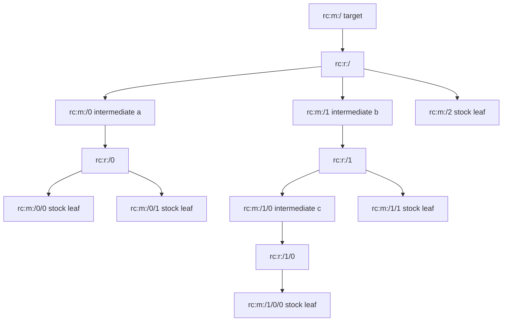

# Route Node IDs

This page explains how RetroCast names individual molecules and reactions inside a `Route`.

A `Route` is a tree. When scoring a route, we often need to say that a particular reaction passed or failed a check, or that some molecule at the end of one branch matched a stock entry. Storing a copy of the whole molecule or reaction in every annotation would be noisy, so annotations point back to the route by path.

For example:

- `rc:m:/` means "the target molecule"
- `rc:r:/` means "the reaction producing the target"
- `rc:m:/1/0` means "the first reactant under the second root reactant's reaction"

These ids are derived from tree position. They are not stored on `Molecule` or `Reaction`, and they are not meant to identify a molecule across routes. If the same buyable appears in two branches, those are two route nodes with two different paths. If two different routes both contain `rc:m:/0`, that only means "first root reactant" in each route.

Use these string ids at artifact, annotation, and UI boundaries. Inside Python code, prefer the typed `RoutePath` object.

## Example Route



The same route as a trimmed `Route` tree, with ids shown as pseudo-fields for illustration:

```json
{
  "target": {
    "id": "rc:m:/",
    "product_of": {
      "id": "rc:r:/",
      "reactants": [
        {
          "id": "rc:m:/0",
          "product_of": {
            "id": "rc:r:/0",
            "reactants": [{ "id": "rc:m:/0/0" }, { "id": "rc:m:/0/1" }]
          }
        },
        {
          "id": "rc:m:/1",
          "product_of": {
            "id": "rc:r:/1",
            "reactants": [
              {
                "id": "rc:m:/1/0",
                "product_of": {
                  "id": "rc:r:/1/0",
                  "reactants": [{ "id": "rc:m:/1/0/0" }]
                }
              },
              { "id": "rc:m:/1/1" }
            ]
          }
        },
        { "id": "rc:m:/2" }
      ]
    }
  }
}
```

## Grammar

```text
route_id  := "rc:" node_kind ":" path
node_kind := "m" | "r"
path      := "/" | "/" index ("/" index)*
index     := nonnegative integer
```

Semantics:

- `rc:m:/` is the target molecule.
- `rc:r:/` is the reaction producing the target molecule.
- `rc:m:/0` is the first reactant molecule of `rc:r:/`.
- `rc:r:/0` is the reaction producing `rc:m:/0`, when that molecule is not a leaf.
- `rc:m:/0/1` is the second reactant molecule under `rc:r:/0`.

The reaction id is always the product molecule path with `rc:r:` instead of `rc:m:`. Child indices are 0-based and follow the route's canonical reactant list order. Depth is the number of numeric path segments:

- `rc:m:/` has depth `0`
- `rc:m:/1` has depth `1`
- `rc:m:/1/0` has depth `2`

## Library Access

Use route accessors instead of parsing ids by hand.

```python
root_reaction = route.reaction_at("rc:r:/")
print(root_reaction.id(), root_reaction.product().id())

child_reaction = route.reaction_at("rc:r:/1/0")
```

`RoutePath` is the typed form used inside the package:

```python
path = RoutePath.parse("rc:m:/1/0")
reaction_path = path.produced_by()

assert reaction_path.id() == "rc:r:/1/0"
assert reaction_path.product().id() == "rc:m:/1/0"
assert reaction_path.reactant(2).id() == "rc:m:/1/0/2"
```

Evaluation annotations use these ids:

```json
{
  "reaction_id": "rc:r:/1/0",
  "validity": {
    "tier 0": { "status": "pass" }
  }
}
```

Do not use route node ids as database keys, molecule identities, cross-route join keys, or stable identifiers after route mutation. Use InChIKey-derived molecule keys and route signatures for chemical or structural comparison.
