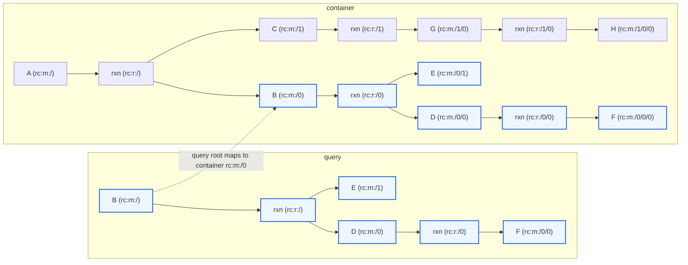
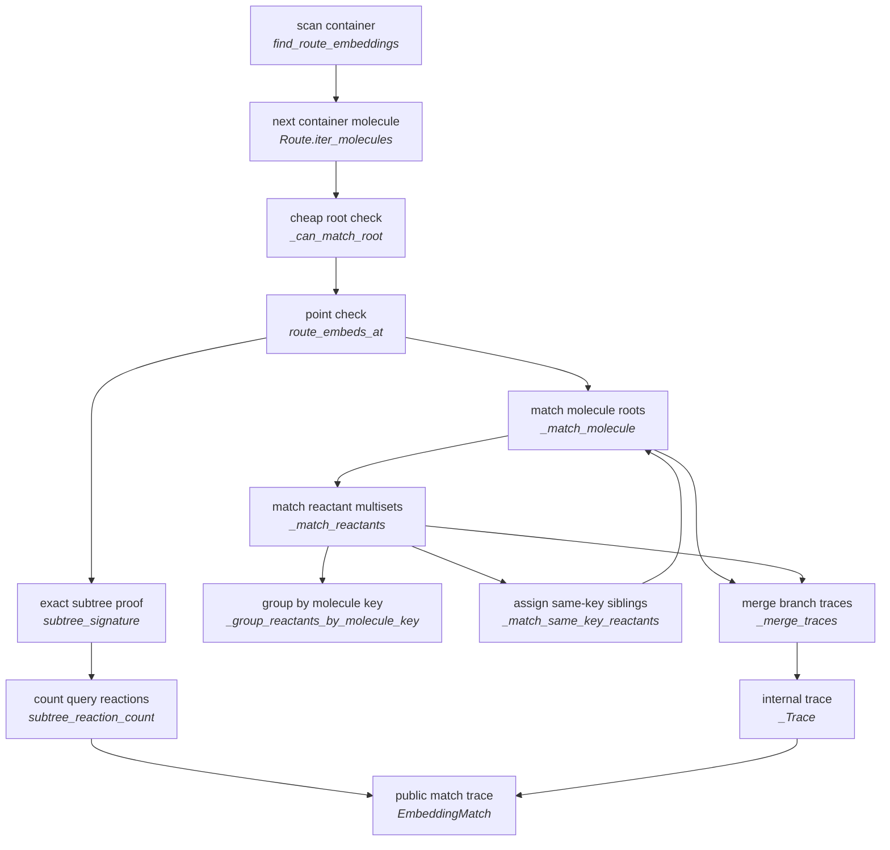
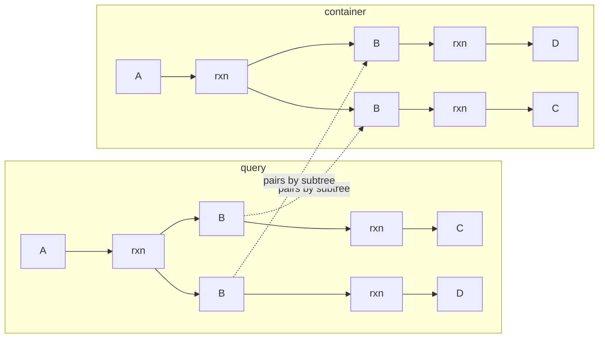

# Route Embedding

Route embedding asks if and where one route fits inside another route.

Basic terms:

- **query**: the route being searched for
- **container**: the route being searched inside
- **embedding**: one valid placement of the query inside the container
- **root-shifted match**: the query target matched an internal molecule in the container
- **leaf extension**: the query stopped at a leaf, but the matched container molecule has more reactions below it

`find_route_embeddings(query, container)` tries to place the query target at each molecule in the container and returns every valid embedding. The query must contain at least one reaction. For molecule membership, use `Route.contains_molecule(...)` or `Route.find_molecules(...)`.

## Examples

An exact full-route match has the same root and the same subtree:

```text
query:     a <- b <- c
container: a <- b <- c
```

```python
find_route_embeddings(query, container) == (
    EmbeddingMatch(
        query_path=RoutePath.target(),      # rc:m:/
        container_path=RoutePath.target(),  # rc:m:/
        matched_reactions=2,
        leaf_extensions=(),
    ),
)
```

An internal embedding matches the query target below the container target:

```text
query:     b <- c
container: a <- b <- c
```

```python
find_route_embeddings(query, container) == (
    EmbeddingMatch(
        query_path=RoutePath.target(),              # query b
        container_path=RoutePath.parse("rc:m:/0"),  # container b
        matched_reactions=1,
        leaf_extensions=(),
    ),
)
```

Here `root_shifted` is true because the query target matched `rc:m:/0`, not the container target.

A leaf-extended embedding matches the query, but the container continues below a query leaf:

```text
query:     a <- b
container: a <- b <- c
```

```python
find_route_embeddings(query, container) == (
    EmbeddingMatch(
        query_path=RoutePath.target(),
        container_path=RoutePath.target(),
        matched_reactions=1,
        leaf_extensions=(
            LeafExtension(
                query_leaf_path=RoutePath.parse("rc:m:/0"),      # query b
                container_path=RoutePath.parse("rc:m:/0"),       # container b
            ),
        ),
    ),
)
```

Here `leaf_extended` is true. The query stopped at `b`; the container has a producing reaction for `b`. The extra container reaction is not counted in `matched_reactions` because it is not part of the query.

An extra sibling is not a leaf extension, and so this query is not contained in the container:

```text
query:     a <- b
container: a <- b + c
```

```python
find_route_embeddings(query, container) == ()
```

A larger internal embedding can match a whole branch of a convergent route:



```python
find_route_embeddings(query, container) == (
    EmbeddingMatch(
        query_path=RoutePath.target(),              # query b
        container_path=RoutePath.parse("rc:m:/0"),  # container b
        matched_reactions=2,
        leaf_extensions=(),
    ),
)
```

The query root lands on container `rc:m:/0`, then the matcher checks the whole rooted branch below that molecule. A query that omitted `E` would fail because matching reactions must have the same unordered reactant multiset.

## Reading a Match

`EmbeddingMatch` is the public result:

```python
class EmbeddingMatch:
    query_path: RoutePath
    container_path: RoutePath
    matched_reactions: int
    leaf_extensions: tuple[LeafExtension, ...]

    @property
    def root_shifted(self) -> bool: ...

    @property
    def leaf_extended(self) -> bool: ...
```

`query_path` names the root of the query-side pattern. In normal scans with `find_route_embeddings(query, container)`, this is `rc:m:/` because the whole query route is being searched. Lower-level callers can use `route_embeds_at(...)` to ask about a specific query subtree, in which case `query_path` records that subtree root.

`container_path` is where that query root matched in the container.

`matched_reactions` counts query-side reactions that were found in the container.

`leaf_extensions` records the query/container boundary pairs where the query stopped and the container continued:

```python
class LeafExtension:
    query_leaf_path: RoutePath
    container_path: RoutePath
```

## Call Flow

At a high level, route embedding is a scan over `MoleculeView`s plus a recursive rooted-tree match:

1. `find_route_embeddings(...)` starts with the query target `MoleculeView`.
2. It scans candidate container molecules from `container.iter_molecules()`.
    - For each candidate container `MoleculeView`, `_can_match_root(...)` rejects the pair if the query molecule key cannot match the container molecule key, or if their local `ReactionView.signature(...)` values cannot match.
    - If the root pair is plausible, `route_embeds_at(...)` checks whether the query target subtree embeds at that candidate container molecule.
3. Inside each `route_embeds_at(...)` point check:
    - If the query target subtree and candidate container molecule subtree have the same `subtree_signature(...)`, the match is accepted immediately. This proves exact rooted-subtree containment, but it does not find shifted roots by itself and it does not express leaf-extension semantics.
    - Otherwise, `_match_molecule(...)` recursively checks the query subtree against the candidate container subtree.
4. Inside the recursive matcher:
    - If the query molecule is a leaf, the container molecule may be a leaf too. If `allow_leaf_extension=True`, the container may instead continue below that molecule and the match records a `LeafExtension`.
    - If the query molecule is not a leaf, the container molecule must also have a producing reaction with the same `ReactionView.signature(...)`.
    - At each matching reaction pair, `_match_reactants(...)` compares the query reactants with the container reactants as an unordered multiset, not a positional list.
    - When same-key siblings make that multiset ambiguous, `_match_same_key_reactants(...)` resolves the pairing. See [duplicate same-key reactants](#duplicate-same-key-reactants).
5. The recursive calls accumulate a `_Trace` with the query reaction count and leaf-extension evidence; `route_embeds_at(...)` wraps it as an `EmbeddingMatch`.



### Duplicate Same-Key Reactants

This is mostly defensive machinery because it is hard to imagine a common chemical route where the same reaction has two same-key synthesized reactants with different downstream histories, but the `Route` model allows it, so for complete correctness of the matcher we have to deal with it.

The ambiguous shape is:



Both root reactions have two `B` reactants. Because reactant order is not semantic, the matcher cannot pair by list position. `_match_same_key_reactants(...)` tries valid assignments inside the same-key sibling group and keeps one where every query `B` maps to a compatible container `B`.
