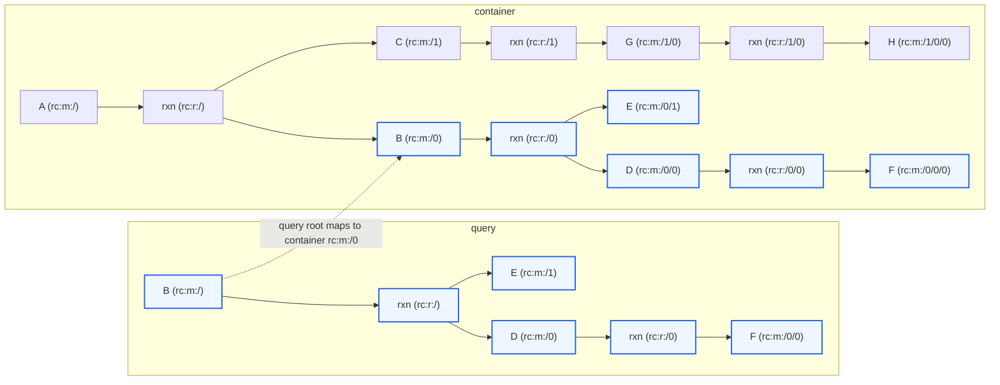
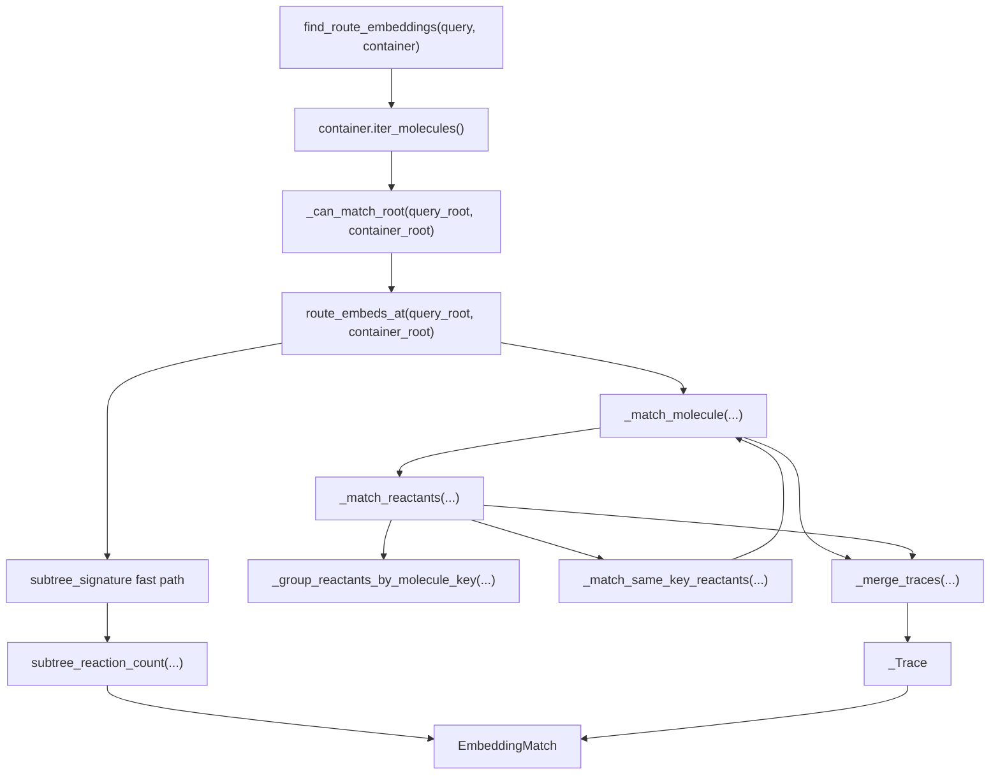

# Route Embedding

Route embedding asks if and where one route fits inside another route.

Basic terms:

- **query**: the route being searched for
- **container**: the route being searched inside
- **embedding**: one valid placement of the query inside the container
- **root-shifted match**: the query target matched an internal molecule in the container
- **leaf extension**: the query stopped at a leaf, but the matched container molecule has more reactions below it

`find_route_embeddings(query, container)` tries to place the query target at each molecule in the container and returns every valid embedding. The query must contain at least one reaction. For molecule membership, use `Route.contains_molecule(...)` or `Route.find_molecules(...)`.

## Examples

An exact full-route match has the same root and the same subtree:

```text
query:     a <- b <- c
container: a <- b <- c
```

```python
find_route_embeddings(query, container) == (
    EmbeddingMatch(
        query_path=RoutePath.target(),      # rc:m:/
        container_path=RoutePath.target(),  # rc:m:/
        matched_reactions=2,
        leaf_extensions=(),
    ),
)
```

An internal embedding matches the query target below the container target:

```text
query:     b <- c
container: a <- b <- c
```

```python
find_route_embeddings(query, container) == (
    EmbeddingMatch(
        query_path=RoutePath.target(),              # query b
        container_path=RoutePath.parse("rc:m:/0"),  # container b
        matched_reactions=1,
        leaf_extensions=(),
    ),
)
```

Here `root_shifted` is true because the query target matched `rc:m:/0`, not the container target.

A leaf-extended embedding matches the query, but the container continues below a query leaf:

```text
query:     a <- b
container: a <- b <- c
```

```python
find_route_embeddings(query, container) == (
    EmbeddingMatch(
        query_path=RoutePath.target(),
        container_path=RoutePath.target(),
        matched_reactions=1,
        leaf_extensions=(
            LeafExtension(
                query_leaf_path=RoutePath.parse("rc:m:/0"),      # query b
                container_path=RoutePath.parse("rc:m:/0"),       # container b
            ),
        ),
    ),
)
```

Here `leaf_extended` is true. The query stopped at `b`; the container has a producing reaction for `b`. The extra container reaction is not counted in `matched_reactions` because it is not part of the query.

An extra sibling is not a leaf extension, and so this query is not contained in the container:

```text
query:     a <- b
container: a <- b + c
```

```python
find_route_embeddings(query, container) == ()
```

A larger internal embedding can match a whole branch of a convergent route:



```python
find_route_embeddings(query, container) == (
    EmbeddingMatch(
        query_path=RoutePath.target(),              # query b
        container_path=RoutePath.parse("rc:m:/0"),  # container b
        matched_reactions=2,
        leaf_extensions=(),
    ),
)
```

The query root lands on container `rc:m:/0`, then the matcher checks the whole rooted branch below that molecule. A query that omitted `E` would fail because matching reactions must have the same unordered reactant multiset.

## Reading a Match

`EmbeddingMatch` is the public result:

```python
class EmbeddingMatch:
    query_path: RoutePath
    container_path: RoutePath
    matched_reactions: int
    leaf_extensions: tuple[LeafExtension, ...]

    @property
    def root_shifted(self) -> bool: ...

    @property
    def leaf_extended(self) -> bool: ...
```

`query_path` names the root of the query-side pattern. In normal scans with `find_route_embeddings(query, container)`, this is `rc:m:/` because the whole query route is being searched. Lower-level callers can use `route_embeds_at(...)` to ask about a specific query subtree, in which case `query_path` records that subtree root.

`container_path` is where that query root matched in the container.

`matched_reactions` counts query-side reactions only. Reactions below leaf-extended container nodes are evidence about the container, not part of the matched query.

`leaf_extensions` records the query/container boundary pairs where the query stopped and the container continued:

```python
class LeafExtension:
    query_leaf_path: RoutePath
    container_path: RoutePath
```

## Call Flow



`find_route_embeddings(...)` is the scan API. It fixes the query root at the query target, walks all container molecules, applies the cheap root check, and returns every successful point match in container traversal order.

`route_embeds_at(...)` is the point API. It checks one selected query molecule against one selected container molecule. Exact subtree signatures are accepted immediately; everything else goes through the recursive matcher.

`_match_molecule(...)` owns the recursive molecule rule: keys must match; query leaves may become leaf extensions; non-leaves require matching producing reactions.

`_match_reactants(...)` owns the reaction-child rule: reactants are unordered, but duplicate multiplicity matters.

`_match_same_key_reactants(...)` resolves duplicate same-key siblings by recursive assignment. It prefers the valid assignment with the fewest leaf extensions, using path ids only to make ties deterministic.

`_Trace` is the internal accumulator for matched reaction count and leaf-extension evidence. `EmbeddingMatch` wraps that trace with the selected query and container roots.

## Match Rules

A query molecule embeds at a container molecule when:

- the two molecule keys match at the requested `InChIKeyLevel`
- if the query molecule is a leaf, the container molecule is either also a leaf or, when `allow_leaf_extension=True`, a non-leaf recorded as a leaf extension
- if the query molecule is not a leaf, the container molecule also has a producing reaction with the same `ReactionView.signature(...)`
- reactants under matching reactions pair as an unordered multiset
- duplicate same-key reactants are assigned recursively by subtree structure, not by list position

`subtree_signature(...)` is a fast exact rooted-subtree proof. If the query root and container root have the same subtree signature, the embedding is exact and has no leaf extensions. Signatures do not find shifted roots by themselves, and they do not express leaf-extension semantics.
