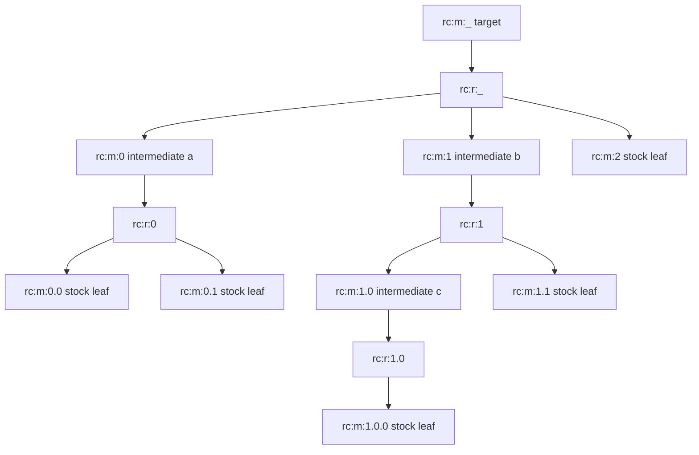

# Route Node IDs

RetroCast uses deterministic route-local ids when evaluation annotations need to point back into a `Route`. These ids are not chemical identities; they are addresses inside one serialized route tree.

## Example Route



The same route as a trimmed `Route` tree, with ids shown as annotations:

```json
{
  "target": {
    "id": "rc:m:_",
    "synthesis_step": {
      "id": "rc:r:_",
      "reactants": [
        {
          "id": "rc:m:0",
          "synthesis_step": {
            "id": "rc:r:0",
            "reactants": [{ "id": "rc:m:0.0" }, { "id": "rc:m:0.1" }]
          }
        },
        {
          "id": "rc:m:1",
          "synthesis_step": {
            "id": "rc:r:1",
            "reactants": [
              {
                "id": "rc:m:1.0",
                "synthesis_step": {
                  "id": "rc:r:1.0",
                  "reactants": [{ "id": "rc:m:1.0.0" }]
                }
              },
              { "id": "rc:m:1.1" }
            ]
          }
        },
        { "id": "rc:m:2" }
      ]
    }
  }
}
```

## Grammar

```text
route_id  := "rc:" node_kind ":" path
node_kind := "m" | "r"
path      := "_" | index ("." index)*
index     := nonnegative integer
```

Semantics:

- `rc:m:_` is the target molecule.
- `rc:r:_` is the reaction producing the target molecule.
- `rc:m:0` is the first reactant molecule of `rc:r:_`.
- `rc:r:0` is the reaction producing `rc:m:0`, when that molecule is not a leaf.
- `rc:m:0.1` is the second reactant molecule under `rc:r:0`.

The reaction id is always the product molecule path with `rc:r:` instead of `rc:m:`. Child indices follow the route's canonical reactant list order.

## Library Access

```python
for route_reaction in route.iter_reactions():
    print(route_reaction.reaction_id, route_reaction.product_id)

route_reaction = route.get_reaction_by_id("rc:r:1.0")
```

Evaluation annotations use these ids:

```json
{
  "reaction_id": "rc:r:1.0",
  "validity": {
    "tier 0": { "status": "pass" }
  }
}
```
