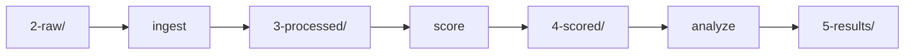

# Command Line Interface

The RetroCast CLI provides a unified interface for standardizing, scoring, and analyzing retrosynthesis predictions.

!!! info "Two modes of operation"

    **Project Mode**
    Structured workflow for reproducible benchmarking of multiple models

    **Ad-Hoc Mode**
    Direct commands for processing individual files without configuration

## Installation

=== "uv (recommended)"

    ```bash
    uv tool install retrocast
    ```

    or, optionally, if you want to create plots during analysis:

    ```bash
    pip install "retrocast[viz]"
    ```

=== "pip"

    ```bash
    pip install retrocast
    ```

    or, optionally, if you want to create plots during analysis:

    ```bash
    uv tool install "retrocast[viz]"
    ```

Verify installation:

```bash
retrocast --version
```

## Global Options

These options apply to all commands:

```bash
retrocast [--config CONFIG] [--data-dir DATA_DIR] <command>
```

| Option       | Description             | Default                 |
| :----------- | :---------------------- | :---------------------- |
| `--config`   | Path to config file     | `retrocast-config.yaml` |
| `--data-dir` | Override data directory | `data/retrocast/`       |

### Data Directory Resolution

The data directory is resolved with the following priority:

1. **CLI flag:** `--data-dir /custom/path`
2. **Environment variable:** `RETROCAST_DATA_DIR=/custom/path`
3. **Config file:** `data_dir: /custom/path` in `retrocast-config.yaml`
4. **Default:** `data/retrocast/`

!!! example "Examples"

    ```bash
    # Use CLI flag (highest priority)
    retrocast --data-dir ./my-data ingest --model my-model --dataset mkt-cnv-160

    # Use environment variable
    RETROCAST_DATA_DIR=./my-data retrocast ingest --model my-model --dataset mkt-cnv-160

    # Check current configuration
    retrocast config
    ```

!!! warning "Migration from older versions"

    The default data directory changed from `data/` to `data/retrocast/` in version 0.6. If you have existing data at `data/`, either:

    - Move it: `mv data/1-benchmarks data/retrocast/`
    - Or set the environment variable: `export RETROCAST_DATA_DIR=data`

## Ad-Hoc Workflow

!!! tip "When to use ad-hoc mode"

    Use these commands to process single files immediately without setting up a project directory. Great for:

    - Quick experiments
    - One-off evaluations
    - Testing new adapters

### `adapt` - Convert Raw Predictions

Convert raw output from a supported model into a prediction route corpus. This is the standalone standardization step introduced in v0.6: it does not need a benchmark unless the raw file is already target-keyed.

```bash
retrocast adapt \
  --input raw_predictions.json.gz \
  --adapter aizynthfinder \
  --input-kind provider-output \
  --output route-corpus.jsonl.gz \
  --benchmark benchmark.json.gz \
  --no-progress
```

1. See available adapters with `retrocast list-adapters`
2. Use `target-keyed-provider-output` when the top-level raw object is keyed by target id or target smiles
3. Optional for `provider-output`; required for `target-keyed-provider-output`
4. Optional: Disable progress bars and use log output only

By default, `adapt` shows route-level progress with count, elapsed time, ETA, and routes per second.

**Supported adapters:** `aizynthfinder`, `askcos`, `directmultistep`, `dreamretroer`, `molbuilder`, `multistepttl`, `paroutes`, `retrochimera`, `retrostar`, `synllama`, `synplanner`, `syntheseus`, `ursa`

### `collect` - Align a Route Corpus to a Benchmark

Collect a prediction route corpus into the benchmark-keyed `routes.json.gz` artifact used for scoring. This is the benchmark-alignment step that used to be hidden inside `ingest`.

```bash
retrocast collect \
  --input route-corpus.jsonl.gz \
  --benchmark benchmark.json.gz \
  --output routes.json.gz
```

### `score-file` - Evaluate Routes

Evaluate benchmark-keyed routes against a stock file.

```bash
retrocast score-file \
  --benchmark benchmark.json.gz \
  --routes routes.json.gz \
  --stock stock_smiles.txt \ # (1)!
  --output evaluation.json.gz \
  --model-name "My-Experiment"
```

1. Text file with one canonical SMILES per line

**Output:** `EvaluationResults` JSON with scored candidates, Tier-0 validity,
stock constraint results, Solv-0[STR] ranks, and benchmark reconstruction ranks.

### `create-benchmark` - Generate Benchmarks

Generate a benchmark definition file from a simple list of SMILES strings.

```bash
retrocast create-benchmark \
  --input targets.txt \ # (1)!
  --name "custom-benchmark" \
  --stock-name "zinc-stock" \
  --output custom-benchmark.json.gz
```

1. Text file or CSV with SMILES strings

---

## Project Workflow

!!! success "Recommended for research"

    For large-scale evaluations, use project mode for:

    - Reproducible benchmarking
    - Multiple models comparison
    - Cryptographic audit trail
    - Automated manifest tracking

### Project Setup

There is no project initializer command in the current CLI. Project mode uses the data directory reported by:

```bash
retrocast config
```

Place raw outputs under:

```text
<data-dir>/2-raw/<model>/<benchmark>/<raw-results-file>
```

Project-mode `ingest` resolves the adapter in this order:

1. `--adapter` passed on the command line
2. `manifest.json` next to the raw file with `directives.adapter`
3. error if neither is provided

If the raw filename is not declared in `manifest.json`, ingest reads `results.json.gz`.

```json title="data/retrocast/2-raw/my-model/mkt-cnv-160/manifest.json"
{
  "directives": {
    "adapter": "aizynthfinder",
    "raw_results_filename": "results.json.gz"
  }
}
```

### The Pipeline



All paths are relative to your data directory (default: `data/retrocast/`).

### `ingest` - Adapt and Collect Routes

Transforms raw model outputs into benchmark-keyed routes by running adaptation
and collection as one command. For target-keyed provider output, it also writes
candidate records so failed raw rank slots are preserved for Tier-0 and MRR
metrics.

```bash
retrocast ingest \
  --model dms-explorer \
  --dataset paroutes-n1 \
  --input-kind target-keyed-provider-output \
  --anonymize \  # (1)!
  --ignore-stereo \  # (2)!
  --no-progress  # (3)!
```

1. Optional: Hashes the model name for blind review
2. Optional: Strip stereochemistry during SMILES canonicalization
3. Optional: Disable progress bars and use log output only

**Input:** `<data-dir>/2-raw/<model>/<dataset>/<raw_results_filename>`  
**Output:** `<data-dir>/3-processed/<dataset>/<model>/routes.json.gz`

For target-keyed provider output, ingest also writes:

`<data-dir>/3-processed/<dataset>/<model>/candidates.json.gz`

**Operations:**

- Adapt raw payloads into a prediction route corpus
- Canonicalize SMILES (optionally ignoring stereochemistry with `--ignore-stereo`)
- Collect canonical routes onto the benchmark by target smiles
- Deduplicate routes within each benchmark target
- Apply sampling strategy (if configured)

For a single model/dataset job, `ingest` shows route-level progress with count, ETA, and routes per second. For `--all-models` or `--all-datasets`, it shows one global job-level progress bar instead of one route-level bar per job. Use `--no-progress` when logs are easier to capture.

!!! warning "Stereochemistry-agnostic processing"

    The `--ignore-stereo` flag removes stereochemical information during canonicalization. This is useful for model developers who want to isolate whether their model struggles specifically with stereochemistry or has broader issues with reaction prediction and stock termination.

    **Not recommended for production evaluation** - stereochemistry is critical for experimental chemistry.

### `score` - Evaluate Candidates

Evaluates processed routes or candidate records against benchmark stock. If
`3-processed/<dataset>/<model>/candidates.json.gz` exists, scoring uses it so
failed raw rank slots count in Tier-0 and raw-rank MRR. Otherwise it falls back
to `routes.json.gz`.

```bash
retrocast score \
  --model dms-explorer \
  --dataset paroutes-n1 \
  --stock-override zinc-stock \  # (1)!
  --ignore-stereo  # (2)!
```

1. Optional: Override default benchmark stock
2. Optional: Perform stereochemistry-agnostic matching by dropping stereochemistry from InChIKeys

**Input:** `<data-dir>/3-processed/<dataset>/<model>/candidates.json.gz` or `routes.json.gz`  
**Output:** `<data-dir>/4-scored/<dataset>/<model>/<stock>/evaluation.json.gz`

**Annotations added:**

- `candidates[].validity["tier 0"]` - Tier-0 route validity in the stored artifact
- `candidates[].validity.reactions[].validity["tier 0"]` - reaction-level Tier-0 failures in the stored artifact
- `candidates[].satisfies_validity(tier=0)` - fluent Tier-0 validity check
- `candidates[].satisfies_solv(tier=0, scope="stock")` - fluent Solv-0[STR] check
- `first_valid_rank(tier=0)` - raw rank of the first Tier-0-valid candidate
- `first_solv_rank(tier=0, scope="stock")` - raw rank of the first Solv-0[STR] candidate
- `reconstruction_rank(scope="stock")` - effective benchmark-reference rank after stock filtering

!!! warning "Stereochemistry-agnostic evaluation"

    The `--ignore-stereo` flag enables stereochemistry-agnostic evaluation. When enabled, molecules that differ only in stereochemistry are treated as identical during scoring. This allows model developers to calculate Top-K accuracy metrics focused on molecular connectivity rather than stereochemical correctness.

    **Use case:** Helps distinguish between stereochemistry-specific issues and fundamental retrosynthesis planning problems.

    **Not recommended for production evaluation** - stereochemistry is critical for experimental chemistry.

### `analyze` - Generate Reports

Aggregates scores into statistical reports with confidence intervals.

```bash
retrocast analyze \
  --model dms-explorer \
  --dataset paroutes-n1 \
  --make-plots \  # (1)!
  --top-k 1 5 10 50  # (2)!
```

1. Generates interactive HTML visualizations
2. Customizes K values (default: 1, 3, 5, 10, 20, 50, 100)

**Input:** `<data-dir>/4-scored/<dataset>/<model>/<stock>/evaluation.json.gz`  
**Output:** `<data-dir>/5-results/<dataset>/<model>/<stock>/`

- `report.md` - Statistical summary
- `*.html` - Interactive plots (if `--make-plots`)

**Metrics computed:**

- Tier-0 validity with 95% CI (bootstrap)
- Solv-0[STR] with 95% CI (Tier-0 validity plus stock termination)
- MRR Tier-0 and MRR Solv-0[STR] over raw candidate ranks
- Top-K benchmark route reconstruction (K ∈ {1, 3, 5, 10, ...})
- Stratified performance by route length

---

## Verification & Auditing

!!! info "Cryptographic audit trail"

    RetroCast generates a `manifest.json` for every file it creates, tracking:

    - Input file SHA256 hashes
    - Command parameters
    - Output file hashes
    - Timestamp and RetroCast version

### `verify` - Check Data Integrity

Verify the integrity of your data pipeline:

```bash
retrocast verify \
  --target data/5-results/paroutes-n1/dms-explorer \
  --deep  # (1)!
```

1. Optional: Recursively verify entire dependency graph

**Verification modes:**

=== "Standard Check"

    Verifies that the file on disk matches the SHA256 hash in its manifest.

    ```bash
    retrocast verify --target 4-scored/model/dataset/
    ```

=== "Deep Check"

    Recursively verifies the entire dependency graph:

    ```
    Analyze → Score → Ingest → Raw
    ```

    Ensures logical consistency across the pipeline.

    ```bash
    retrocast verify --target 5-results/model/dataset/ --deep
    ```

**What it detects:**

- :warning: Data corruption
- :warning: Manual file tampering
- :warning: Out-of-order execution
- :warning: Hash mismatches

---

## Configuration & Debugging

### `config` - Show Resolved Configuration

Display the resolved data directory and paths, useful for debugging path issues:

```bash
retrocast config
```

**Output:**

```
RetroCast Configuration
========================================

Data directory: /path/to/project/data/retrocast
  Source: default

Environment:
  RETROCAST_DATA_DIR: not set

Resolved paths:
  benchmarks: data/retrocast/1-benchmarks/definitions (exists)
  stocks    : data/retrocast/1-benchmarks/stocks (exists)
  raw       : data/retrocast/2-raw (missing)
  processed : data/retrocast/3-processed (missing)
  scored    : data/retrocast/4-scored (missing)
  results   : data/retrocast/5-results (missing)
```

!!! tip "Debugging path issues"

    If commands can't find your data, run `retrocast config` to see where RetroCast is looking and which paths exist.

---

## Helper Commands

### `list` - Show Configured Models

Lists all models in `retrocast-config.yaml`:

```bash
retrocast list
```

**Output:**

```
Configured models:
  - dms-explorer (adapter: directmultistep)
  - aizynthfinder-mcts (adapter: aizynthfinder)
  - retro-star (adapter: retrostar)
```

### `list-adapters` - Show Available Adapters

Lists all built-in adapters:

```bash
retrocast list-adapters
```

**Output:**

```
Available adapters:
  - aizynthfinder: AiZynthFinder (bipartite graph)
      deprecated aliases: aizynth
  - askcos: ASKCOS (custom format)
  - directmultistep: DirectMultiStep (recursive dict)
      deprecated aliases: dms
  - dreamretroer: DreamRetroEr (precursor map)
      deprecated aliases: dreamretro
  - molbuilder: MolBuilder (tree format)
  - multistepttl: MultiStepTTL (custom format)
  - paroutes: PaRoutes (reference format)
  - retrochimera: RetroChimera (precursor map)
  - retrostar: Retro* (precursor map)
  - synllama: SynLlama (precursor map)
  - synplanner: SynPlanner (bipartite graph)
  - syntheseus: Syntheseus (bipartite graph)
  - ursa: URSA (<synthesis_step> XML blocks)
```

### `info` - Show Model Details

Display configuration details for a specific model:

```bash
retrocast info --model dms-explorer
```

**Output:**

```yaml
Model: dms-explorer
  Adapter: directmultistep
  Raw results filename: predictions.json
  Sampling:
    Strategy: top-k
    K: 50
```

---

## Command Reference

### Quick Lookup

| Command | Purpose | Input | Output |
| :-- | :-- | :-- | :-- |
| `config` | Show resolved paths | - | Configuration display |
| `adapt` | Convert raw → standardized | Raw predictions | Prediction route corpus (`.jsonl.gz`) |
| `score-file` | Evaluate routes | Routes + stock | Scored routes |
| `create-benchmark` | Generate benchmark | SMILES list | Benchmark JSON |
| `ingest` | Standardize (project mode) | `2-raw/` | `3-processed/` |
| `score` | Evaluate (project mode) | `3-processed/` | `4-scored/` |
| `analyze` | Generate report | `4-scored/` | `5-results/` |
| `verify` | Audit integrity | Manifest files | Validation report |
| `list` | Show models discovered from raw manifests | `2-raw/` | Model list |
| `list-adapters` | Show adapters | - | Adapter list |

### Advanced Options

#### Stereochemistry Control

Both `ingest` and `score` commands support the `--ignore-stereo` flag for stereochemistry-agnostic processing:

| Command | Flag | Purpose | Use Case |
| :-- | :-- | :-- | :-- |
| `ingest` | `--ignore-stereo` | Strip stereochemistry during canonicalization | Analyze Tier-0 and Solv-0[STR] without stereochemical constraints |
| `score` | `--ignore-stereo` | Perform stereochemistry-agnostic matching | Calculate Top-K accuracy independent of stereochemistry |

!!! note "For model developers"

    The `--ignore-stereo` flag is primarily useful for model development and diagnostic purposes. It allows you to determine whether prediction errors stem from stereochemical confusion or more fundamental retrosynthetic planning issues.

    **Not recommended for evaluating production models** - stereochemistry is critical for experimental chemistry.
