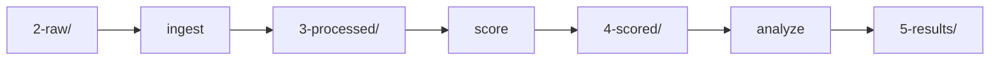

# Command Line Interface

The RetroCast CLI provides two ways to run schema-2 workflows.

Project mode uses the standard data directory and writes manifests for reproducible benchmarking. Ad-hoc mode works directly on explicit files and is useful for small experiments, debugging adapters, or notebooks.

!!! info "Two modes of operation"

    **Project mode** is the structured workflow for reproducible benchmarking of one or more models.

    **Ad-hoc mode** is for direct file-to-file commands when you do not want to use the project directory layout.

## Installation

Download the standalone archive for your platform from [GitHub Releases](https://github.com/ischemist/project-procrustes/releases). Each archive contains the `retrocast` executable and its required native libraries. The PyPI wheel is the Python binding and does not install this command.

Verify installation:

```bash
retrocast --version
```

## Global Options

These options apply to all commands:

```bash
retrocast [--config CONFIG] [--data-dir DATA_DIR] <command>
```

| Option       | Description             | Default                 |
| ------------ | ----------------------- | ----------------------- |
| `--config`   | Path to config file     | `retrocast-config.yaml` |
| `--data-dir` | Override data directory | `data/retrocast/`       |

### Data Directory Resolution

The data directory is resolved in this order:

1. CLI flag: `--data-dir /custom/path`
2. environment variable: `RETROCAST_DATA_DIR=/custom/path`
3. config file: `data_dir: /custom/path` in `retrocast-config.yaml`
4. default: `data/retrocast/`

Check the resolved configuration with:

```bash
retrocast config
```

Examples:

```bash
# Use CLI flag. This has highest priority.
retrocast --data-dir ./my-data ingest --model my-model --dataset mkt-cnv-160

# Use environment variable.
RETROCAST_DATA_DIR=./my-data retrocast ingest --model my-model --dataset mkt-cnv-160

# Inspect where RetroCast is looking.
retrocast --data-dir ./my-data config
```

!!! warning "Migration from older versions"

    The default data directory changed from `data/` to `data/retrocast/` in version 0.6. If you have existing data at `data/`, either move the RetroCast subdirectories under `data/retrocast/` or set `RETROCAST_DATA_DIR=data`.

## Ad-Hoc Workflow

Use ad-hoc commands when you want to process explicit files without placing them in `2-raw/`.

!!! tip "When to use ad-hoc mode"

    Use this mode for quick experiments, one-off evaluations, adapter debugging, and notebooks. If you are running a full benchmark across model directories, use project mode instead.

```text
raw artifact -> adapt -> candidates -> collect -> collected candidates -> score-file -> evaluation
```

### `adapt` - Convert Raw Predictions

`adapt` casts raw planner output into ranked schema-2 `Candidate`s. Each candidate contains either a valid `Route` or a `FailureRecord`.

```bash
retrocast adapt \
  --adapter paroutes \
  --input raw.json.gz \
  --output candidates.json.gz
```

Options:

| Option | Meaning |
| --- | --- |
| `--adapter` | Adapter slug, e.g. `paroutes`, `aizynthfinder`, `directmultistep` |
| `--mode strict` | Reject a raw route record if any required chemistry is invalid |
| `--mode prune` | Keep the longest valid prefix when the adapter can safely prune invalid branches |
| `--max-candidates N` | Adapt only the first N raw prediction slots |

List adapters with:

```bash
retrocast list-adapters
```

### `collect` - Align Candidates To A Benchmark

`collect` maps candidates onto benchmark targets.

```bash
retrocast collect \
  --input candidates.json.gz \
  --benchmark benchmark.json.gz \
  --output collected.json.gz
```

Successful candidates are collected by route target identity. Failed candidates are collected by the target hints preserved in their `FailureRecord`.

### `score-file` - Evaluate Collected Candidates

`score-file` scores collected candidates against a benchmark task and stock file.

```bash
retrocast score-file \
  --benchmark benchmark.json.gz \
  --candidates collected.json.gz \
  --stock buyables-stock.txt \
  --output evaluation.json.gz
```

Options:

| Option | Meaning |
| --- | --- |
| `--stock-name` | Stock label to write into task constraints; defaults to the stock filename stem |
| `--model-name` | Optional model label for manifest metadata |
| `--ignore-stereo` | Use stereo-agnostic stock and acceptable-route matching |
| `--acceptable-route-match prefix\|exact` | Match acceptable routes by target-rooted prefix (default) or exact full-route identity |

`score-file` writes an `Evaluation` artifact. Tier-0 validity comes from adaptation success or failure; task satisfaction comes from the configured constraints. `--acceptable-route-match` is applied when this artifact is scored; rerunning `analyze` on an existing `Evaluation` does not retroactively change its stored acceptable-route matches.

### `compare pareto-frontier` - Compare Reports

`compare pareto-frontier` compares schema-2 analysis reports against cost or runtime metadata.

```bash
retrocast compare pareto-frontier compare.yaml --no-open
```

```yaml title="compare.yaml"
benchmark: small
stock: buyables
metric: solv_0[buyables]_rate
output_dir: comparisons
sources:
  - root: data/retrocast
    models:
      - name: model-a
        hourly_cost: 1.0
      - name: model-b
        hourly_cost: 0.5
```

## Project Workflow

!!! success "Recommended for research"

    Project mode is the right default for reproducible benchmarking, multi-model comparison, manifest tracking, and long-running experiments.

Project mode uses the standard data directory:

```text
data/retrocast/
  1-benchmarks/
    definitions/
    stocks/
  2-raw/
  3-processed/
  4-scored/
  5-results/
```

### Project Setup

Put raw output under:

```text
<data-dir>/2-raw/<model>/<benchmark>/<raw-results-file>
```

Project-mode `ingest` resolves the adapter in this order:

1. `--adapter` on the command line
2. `manifest.json` next to the raw file with `directives.adapter`
3. error if neither is provided

If the raw filename is not declared in `manifest.json`, ingest reads `results.json.gz`.

```json title="data/retrocast/2-raw/my-model/mkt-cnv-160/manifest.json"
{
  "directives": {
    "adapter": "aizynthfinder",
    "raw_results_filename": "results.json.gz"
  }
}
```

### Evaluation flow



All paths are relative to your data directory.

### `ingest` - Adapt and Collect Candidates

`ingest` runs `adapt + collect` for one or more model/benchmark pairs.

```bash
retrocast ingest \
  --model my-model \
  --dataset mkt-cnv-160 \
  --adapter aizynthfinder
```

Useful options:

| Option               | Meaning                                                      |
| -------------------- | ------------------------------------------------------------ |
| `--mode strict`      | Strict adaptation, the default                               |
| `--mode prune`       | Adapter may prune invalid branches when supported            |
| `--max-candidates N` | Ingest only the first N raw prediction slots per target      |
| `--no-progress`      | Disable progress bars                                        |
| `--all-models`       | Run over all model directories for the selected dataset(s)   |
| `--all-datasets`     | Run over all benchmark definitions for the selected model(s) |

Input:

```text
<data-dir>/2-raw/<model>/<benchmark>/<raw_results_filename>
```

Output:

```text
<data-dir>/3-processed/<benchmark>/<model>/candidates.json.gz
```

The output is collected `Candidate`s keyed by target id. Failed adaptation slots are preserved so Solv-0 and MRR denominators remain honest.

### `score` - Evaluate Candidates

`score` evaluates processed candidates for one or more model/benchmark pairs.

```bash
retrocast score \
  --model my-model \
  --dataset mkt-cnv-160
```

Useful options:

| Option | Meaning |
| --- | --- |
| `--ignore-stereo` | Use stereo-agnostic stock and acceptable-route matching |
| `--acceptable-route-match prefix\|exact` | Match acceptable routes by target-rooted prefix (default) or exact full-route identity |
| `--all-models` | Score all processed models for the selected dataset(s) |
| `--all-datasets` | Score the selected model(s) across all benchmark definitions |

`--acceptable-route-match` is applied when the `Evaluation` is scored; rerun `score` before `analyze` to apply different matching semantics to existing processed candidates.

Input:

```text
<data-dir>/3-processed/<benchmark>/<model>/candidates.json.gz
```

Output:

```text
<data-dir>/4-scored/<benchmark>/<model>/<stock>/evaluation.json.gz
```

The output is an `Evaluation`: scored candidates plus the task context needed to interpret Solv-N metrics.

### `analyze` - Generate Reports

`analyze` summarizes evaluation artifacts into an `AnalysisReport` and a markdown report.

```bash
retrocast analyze \
  --model my-model \
  --dataset mkt-cnv-160
```

Useful options:

| Option                 | Meaning                                                        |
| ---------------------- | -------------------------------------------------------------- |
| `--stock`              | Analyze one stock directory under `4-scored`                   |
| `--top-k 1 5 10 50`    | K values for acceptable-route reconstruction                   |
| `--prefix-depth 1 2 3` | Depths for acceptable-route prefix reconstruction diagnostics  |
| `--n-boot 10000`       | Number of bootstrap resamples                                  |
| `--all-models`         | Analyze all scored models for the selected dataset(s)          |
| `--all-datasets`       | Analyze the selected model(s) across all benchmark definitions |

Outputs:

```text
<data-dir>/5-results/<benchmark>/<model>/<stock>/analysis.json.gz
<data-dir>/5-results/<benchmark>/<model>/<stock>/report.md
```

## Verification & Auditing

RetroCast writes a `manifest.json` next to generated project-mode artifacts. The manifest records inputs, outputs, parameters, hashes, and workflow statistics.

### `verify` - Check Data Integrity

Verify all manifests under a data directory:

```bash
retrocast --data-dir data/retrocast verify --all
```

Verify one manifest or directory:

```bash
retrocast verify --target data/retrocast/5-results/mkt-cnv-160/my-model/buyables
```

Use `--deep` to follow generated-artifact manifest links. Use `--strict` to treat missing files as failures.

## Configuration & Debugging

### `config` - Show Resolved Configuration

Shows the resolved data directory and project paths.

```bash
retrocast config
```

If commands cannot find your files, start here. It shows exactly which data directory RetroCast resolved and which stage directories exist.

## Helper Commands

### `list` - Show Raw Manifests

Lists raw model/benchmark manifests discovered under `2-raw/`.

```bash
retrocast --data-dir data/retrocast list
```

### `list-adapters` - Show Available Adapters

Lists built-in adapters and deprecated adapter slug aliases.

```bash
retrocast list-adapters
```

## Command Reference

| Command | Purpose | Input | Output |
| --- | --- | --- | --- |
| `config` | Show resolved paths | config/env/CLI flags | configuration display |
| `list` | Show raw manifests | `2-raw/` | model, benchmark, adapter, raw file table |
| `list-adapters` | Show adapters | none | adapter slug list |
| `adapt` | Cast raw planner output | raw JSON artifact | `list[Candidate]` |
| `collect` | Map candidates onto targets | candidates + benchmark | collected candidates |
| `score-file` | Score explicit files | collected candidates + stock | `Evaluation` |
| `compare pareto-frontier` | Compare reports against cost/time | comparison YAML | HTML plot |
| `ingest` | Project-mode adapt + collect | `2-raw/` | `3-processed/.../candidates.json.gz` |
| `score` | Project-mode evaluation | processed candidates | `4-scored/.../evaluation.json.gz` |
| `analyze` | Project-mode metrics | evaluation | `5-results/.../analysis.json.gz` and `report.md` |
| `verify` | Audit manifests and hashes | manifest files | validation report |
