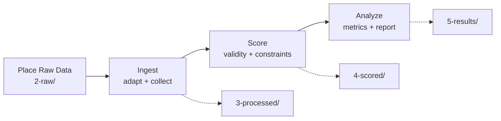

# Quick Start

This guide gets you from raw planner output to a RetroCast analysis report.

!!! tip "What you'll learn"

    - Install RetroCast and inspect the data directory layout
    - Place raw planner output where project-mode commands expect it
    - Run the `ingest` -> `score` -> `analyze` pipeline

## 1. Install

=== "uv (recommended)"

    We recommend installing RetroCast as a standalone tool using `uv`:

    ```bash
    uv tool install retrocast
    ```

    If you don't have `uv`, you can install it in one minute:

    ```bash
    curl -LsSf https://astral.sh/uv/install.sh | sh
    ```

=== "pip"

    ```bash
    pip install retrocast
    ```

Verify installation:

```bash
retrocast --version
```

## 2. Check Project Paths

Project-mode commands use a structured data directory. Inspect the resolved layout before placing files:

```bash
retrocast config
```

By default, RetroCast uses `data/retrocast/` with subdirectories for benchmarks, raw planner outputs, processed candidates, scored evaluations, and analysis reports. The directories are created as commands write artifacts.

!!! tip "Custom data directory"

    You can customize the data directory location via:

    - CLI flag: `retrocast --data-dir ./my-data <command>`
    - Environment variable: `export RETROCAST_DATA_DIR=./my-data`
    - Config file: Add `data_dir: ./my-data` to `retrocast-config.yaml`

    Run `retrocast config` to see the resolved paths.

## 3. Choose An Adapter

Adapters cast planner-specific raw output into schema-2 `Route`s. List supported adapters:

```bash
retrocast list-adapters
```

For one-off runs, pass the adapter directly to `ingest`:

```bash
retrocast ingest --model my-new-model --dataset mkt-cnv-160 --adapter aizynthfinder
```

For repeatable raw-data folders, put a `manifest.json` next to the raw results file:

```json
{
  "directives": {
    "adapter": "aizynthfinder",
    "raw_results_filename": "predictions.json.gz"
  }
}
```

If no filename is declared, project-mode ingest reads `results.json.gz`.

To see examples of runner scripts for different planners that we use for benchmarking, take a look at the [ischemist/project-pandora repo](https://github.com/ischemist/project-pandora).

## 4. The Workflow

The project-mode workflow is:



All paths are relative to your data directory.

### Step A: Place Raw Data

Put your model's raw output file in `2-raw/`:

```text
<data-dir>/2-raw/<model-name>/<benchmark-name>/<filename>
```

Example:

```bash
mkdir -p data/retrocast/2-raw/my-new-model/mkt-cnv-160
cp results.json.gz data/retrocast/2-raw/my-new-model/mkt-cnv-160/
```

!!! info "Available benchmarks"

    See [Benchmarks Guide](guides/benchmarks.md) for details on evaluation sets.

### Step B: Ingest

`ingest` adapts raw planner output and collects the resulting rank-preserving `Candidate`s onto benchmark targets.

By default, project-mode ingest reads `results.json.gz`. If your raw file uses a different name, add a `manifest.json` in the same directory with a `raw_results_filename` directive.

```bash
retrocast ingest --model my-new-model --dataset mkt-cnv-160 --adapter aizynthfinder
```

Output:

```text
data/retrocast/3-processed/mkt-cnv-160/my-new-model/candidates.json.gz
```

### Step C: Score

`score` applies Tier-N validity checks and task constraints, producing an `Evaluation`.

```bash
retrocast score --model my-new-model --dataset mkt-cnv-160
```

Output:

```text
data/retrocast/4-scored/mkt-cnv-160/my-new-model/<stock>/evaluation.json.gz
```

### Step D: Analyze

`analyze` summarizes the evaluation into Solv-N rates, MRR@Solv-N, confidence intervals, and acceptable-route reconstruction metrics when available.

```bash
retrocast analyze --model my-new-model --dataset mkt-cnv-160
```

Outputs:

```text
data/retrocast/5-results/mkt-cnv-160/my-new-model/<stock>/analysis.json.gz
data/retrocast/5-results/mkt-cnv-160/my-new-model/<stock>/report.md
```

!!! success "You're done"

    Open the generated `report.md` for the benchmark summary.

## Alternative: Explicit Files

If you do not want to use the project directory layout, run the explicit-file commands:

```bash
retrocast adapt \
  --adapter paroutes \
  --input raw.json.gz \
  --output candidates.json.gz

retrocast collect \
  --input candidates.json.gz \
  --benchmark benchmark.json.gz \
  --output collected.json.gz

retrocast score-file \
  --benchmark benchmark.json.gz \
  --candidates collected.json.gz \
  --stock buyables-stock.txt \
  --output evaluation.json.gz
```

This is useful for small experiments, notebooks, or custom pipelines where you do not want RetroCast to manage `2-raw` through `5-results`.

## Choose A Path

RetroCast has three common entry points depending on what you are trying to do:

| Goal | Use this | Result |
| --- | --- | --- | --- |
| Cast one raw route-like record inside Python | `adapt_route(...)` | `Route | None` |
| Inspect only valid routes from a raw artifact | `adapt_routes(...)` | `list[Route]` |
| Preserve benchmark prediction slots, including failures | `adapt_candidates(...)` or `ingest_candidates(...)` | `Candidate`s with `Route` or `FailureRecord` |
| Run the managed file-based benchmark workflow | `retrocast ingest` -> `retrocast score` -> `retrocast analyze` | `candidates.json.gz`, `evaluation.json.gz`, `analysis.json.gz`, `report.md` |

If you are evaluating a model, use the candidate-preserving path. If you are just inspecting chemistry, route-only adaptation is usually simpler.

## Python API

The same workflows are available from Python:

```python
from retrocast import get_adapter
from retrocast.io import load_benchmark
from retrocast.workflow import ingest_candidates

task = load_benchmark(benchmark_path)
adapter = get_adapter("paroutes")
predictions = ingest_candidates(raw_payload, adapter, task)
```

Use `adapt_route(...)` or `adapt_routes(...)` for route-first inspection. Use `adapt_candidates(...)` or `ingest_candidates(...)` when failed prediction slots must remain visible for evaluation.

## Next Steps

**Learn the Concepts**  
Read [Concepts](concepts.md) to understand the schema-2 model and workflow.

**Understand Schema Design**  
Read [Schema Design](/rationale/schema-design) for the deeper data-model rationale.

**Use the Python API**  
Use the `retrocast.workflow` functions when integrating RetroCast into your own scripts.

**Write Custom Adapters**  
Need to support a new output format? See [Writing a Custom Adapter](developer-reference/adapters.md).

**Full CLI Reference**  
See all available commands in the [CLI Reference](guides/cli.md).

**Explore Benchmarks**  
Learn about evaluation sets in the [Benchmarks Guide](guides/benchmarks.md).

**From isChemist: Structure precedes quantity.**  
Essays and software that make better scientific questions possible. Subscribe at [ischemist.com/newsletter](https://ischemist.com/newsletter), or check [service status](https://status.ischemist.com) if hosted RetroCast resources or SynthArena look off.
