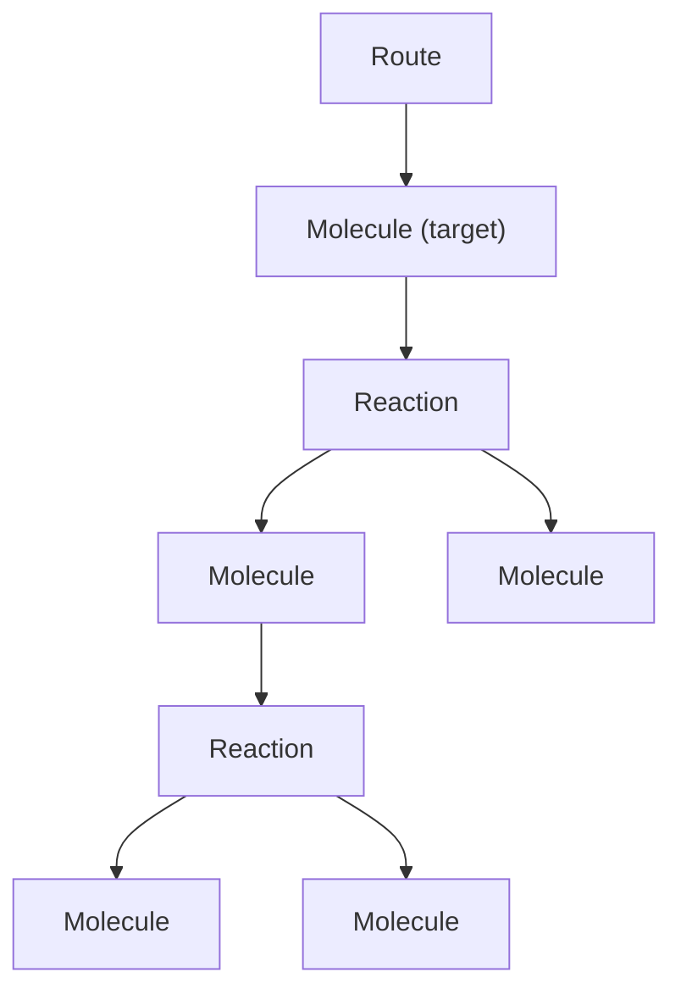

# Schema Design

This document captures the thinking process for the core data model and workflow design in RetroCast. It is a more elaborate version of the [concepts overview page](/concepts) and is the primary place to build a mental model of the codebase.

## Goals

RetroCast is designed to handle two broad use cases:

- casting arbitrary planner output into canonical `Route`s
- evaluating those outputs for one target or many targets

## Route

In RetroCast, a `Route` is an AND/OR tree of `Molecule` and `Reaction` nodes.

```text
Route -> Molecule -> Reaction -> Molecule -> Reaction -> ...
```



Basic schema

```python
class Molecule(BaseModel):
    smiles: SmilesStr
    inchikey: InchiKeyStr
    product_of: Reaction | None = None
    annotations: dict[str, Any] = Field(default_factory=dict)


class Reaction(BaseModel):
    reactants: list[Molecule]
    mapped_reaction_smiles: ReactionSmilesStr | None = None
    template: str | None = None
    reagents: list[SmilesStr] | None = None
    solvents: list[SmilesStr] | None = None
    annotations: dict[str, Any] = Field(default_factory=dict)


class Route(BaseModel):
    target: Molecule
    annotations: dict[str, Any] = Field(default_factory=dict)
    schema_version: str = "2"
```

Identical molecules in different positions (e.g. same building block used in two branches) are different nodes; whence a Route is a tree, not just a DAG. Primarily because enforcing a 1 molecule = 1 node would introduce operational (serialization, signatures) complexity without any clear/obvious benefit beyond just marginally smaller disk usage.

### Route path

RetroCast uses deterministic paths to refer to molecules and reactions inside a `Route`. The full grammar lives in [Route Node IDs](developers/route-node-ids); but here's a useful cheat sheet:

- `rc:m:/` root target molecule
- `rc:r:/` root reaction
- `rc:m:/0` first reactant under `rc:r:/`
- `rc:r:/0` reaction producing `rc:m:/0`
- `rc:m:/1/0` first child under `rc:m:/1`

these IDs are derived in memory and are not serialized. internally, they should be represented as typed addresses, not repeatedly parsed strings:

```python
class RoutePath(BaseModel):
    kind: Literal["m", "r"]
    indices: tuple[int, ...] = ()

    @classmethod
    def parse(cls, value: str) -> RoutePath: ...

    @classmethod
    def target(cls) -> RoutePath: ...

    @classmethod
    def root_reaction(cls) -> RoutePath: ...

    def id(self) -> str: ...
    def depth(self) -> int: ...

    def is_molecule(self) -> bool: ...
    def is_reaction(self) -> bool: ...

    def produced_by(self) -> RoutePath: ...
    def product(self) -> RoutePath: ...
    def reactant(self, index: int) -> RoutePath: ...
```

semantics:

- `RoutePath.target()` is `rc:m:/`
- `RoutePath.root_reaction()` is `rc:r:/`
- `RoutePath.parse("rc:m:/1/0").produced_by()` is `rc:r:/1/0`
- `RoutePath.parse("rc:r:/1/0").product()` is `rc:m:/1/0`
- `RoutePath.parse("rc:r:/1/0").reactant(2)` is `rc:m:/1/0/2`

for convenience, we define the following subtypes:

```py
def validate_reaction_id(value: str) -> str:
    path = RoutePath.parse(value)
    if not path.is_reaction():
        raise ValueError("reaction id must identify a reaction node, e.g. 'rc:r:/1/0'")
    return value

def validate_molecule_id(value: str) -> str:
    path = RoutePath.parse(value)
    if not path.is_molecule():
        raise ValueError("molecule id must identify a molecule node, e.g. 'rc:m:/1/0'")
    return value

ReactionId = Annotated[str, AfterValidator(validate_reaction_id)]
MoleculeId = Annotated[str, AfterValidator(validate_molecule_id)]
```


## Route Signatures

`Route` signatures give us a canonical way to talk about route structure without carrying around the whole tree or comparing nested objects by hand. They are the basis for route comparison: full-route equality, reaction equality, prefix matching to depth `k`, and subtree containment. The core idea is [Merkle-like](https://en.wikipedia.org/wiki/Merkle_tree): the signature of a parent is built from its own identity plus the signatures of its children. Signatures are:

- order-invariant over reactant ordering
- preserve multiplicity when the same reactant appears more than once
- and can be parameterized by match level when needed. 

### Molecule Identity

We use [InChiKeys](https://en.wikipedia.org/wiki/International_Chemical_Identifier) as molecular identity. RetroCast currently supports three levels of InChiKey specificity:

- `retrocast.chem.InChIKeyLevel.FULL` - full 27-char InChIKey
- `retrocast.chem.InChIKeyLevel.NO_STEREO` - 27-char InChIKey generated without stereochemical information
- `retrocast.chem.InChIKeyLevel.CONNECTIVITY` - first 14 chars, connectivity layer only

Most users should use the default `FULL` level, but sometimes a model developer might wish to disambiguate planner's failure to account for proper stereochemistry from more fundamental failures to find the right connectivity (wherefore he might use `NO_STEREO`). Or might want to ignore isotope/protonation differences (wherefore `CONNECTIVITY`).

```python
class Molecule(BaseModel):
    ...

    def key(self, match_level: InChIKeyLevel = InChIKeyLevel.FULL) -> str:
        return reduce_inchikey(self.inchikey, match_level)
    def signature(self, match_level: InChIKeyLevel = InChIKeyLevel.FULL) -> str:
        return stable_hash(self.key(match_level))
```

### Reaction Identity

At the most basic structural level, a reaction identity is defined by the structures of reactants and product. Defining `key` and `signature` method on a `Reaction` class is not possible without having a pointer to the `Reaction` product. There are two options:

- treat `Reaction` as a Route-specific occurrence object (with an explicit pointer to its product), but that requires writing custom serialization logic and ensuring loaded Reaction objects are always "hydrated" with proper parent references. Violates the spirit of [SRP](https://en.wikipedia.org/wiki/Single-responsibility_principle) and I'm a bit WebDev-brained not to think of the Data-View split analogy, so instead
- we create a `ReactionView` model that provides a required route-contextual representation of a `Reaction`.

```python
class ReactionView:
    route: Route
    path: RoutePath
    value: Reaction

    def product(self) -> MoleculeView: ...
    def reactants(self) -> list[MoleculeView]: ...

    def key(self, match_level: InChIKeyLevel = InChIKeyLevel.FULL) -> tuple:
        return (
            "rxn",
            self.product().key(match_level),
            tuple(sorted(r.key(match_level) for r in self.reactants())),
        )

    def signature(self, match_level: InChIKeyLevel = InChIKeyLevel.FULL) -> str:
        return stable_hash(self.key(match_level))
```

for consistency in api design and ease of subtree comparison, we also define a similar view model for `Molecule`.

```python
class MoleculeView:
    route: Route
    path: RoutePath
    value: Molecule

    def key(self, match_level: InChIKeyLevel = InChIKeyLevel.FULL) -> str:
        return self.value.key(match_level)

    def produced_by(self) -> ReactionView | None: ...

    def subtree_key(self, match_level=InChIKeyLevel.FULL, *, depth=None):
        if self.value.product_of is None or depth == 0:
            return ("mol", self.key(match_level))

        next_depth = None if depth is None else depth - 1
        reaction = self.produced_by()
        child_sigs = sorted(
            reactant.subtree_signature(match_level, depth=next_depth)
            for reactant in reaction.reactants()
        )

        return (
            "mol",
            self.key(match_level),
            reaction.key(match_level),
            tuple(child_sigs),
        )

    def subtree_signature(self, match_level=InChIKeyLevel.FULL, *, depth=None):
        return stable_hash(self.subtree_key(match_level, depth=depth))
```


### Route Identity

With the primitives above, full route equality is established by the subtree signature of the target with unlimited depth. i.e. `route.signature()` is an alias for `route.molecule_at("rc:m:/").subtree_signature()`. A generic exact subtree equality is `route.molecule_at(path).subtree_signature()`.

We often might be interested in asking how far along the plan (starting from the target) do any two Routes agree? Such prefix matching is simply a subtree signature of fixed depth `k` rooted at the target.

```python
class Route(BaseModel):
    ...

    def key(
        self,
        match_level: InChIKeyLevel = InChIKeyLevel.FULL,
        *,
        depth: int | None = None,
    ) -> tuple:
        return self.target().subtree_key(match_level, depth=depth)

    def signature(
        self,
        match_level: InChIKeyLevel = InChIKeyLevel.FULL,
        *,
        depth: int | None = None,
    ) -> str:
        return stable_hash(self.key(match_level, depth=depth))
```

### Route Embedding

To be defined later, once we finish the basic migration. A subtree signature primitive simplifies simple queries like "does a <- b <- c <- d" contain "a <- b", so it's part of the solution, but it doesn't help with containment check for queries like "b <- c".

## Workflows

Raw planner payloads can be `adapt`ed into `Route` objects, which constitute fully Tier-0 valid routes, or `Candidate` objects, which preserve failed slots for proper accounting of Solv-0. Canonical `Candidates` can be `collect`ed into predictions for each `Target`/`Task`. A collection of `Task`s is a `Benchmark`.

Direct `adapt`ing is useful for single-target pipelines. For benchmarking, one can use `ingest` which is `adapt`ing and `collect`ing into `Benchmark` predictions.

`Benchmark` predictions are keyed by target id. These predictions can be `score`d with Tier-N validity checks against `TaskConstraints`, resulting in Solv-N values. Predictions can also be compared against `Target.acceptable_routes` to obtain Top-K reconstruction accuracy.

## 1. Adapt

By default, adapt tries to turn raw planner output into canonical `Route` objects and if fails, returns None. While it's a reasonable default for regular planning, it inflates the Tier-0 validity of the planner's predictions for strict benchmarking. As such, `adapt` can be configured to return `Candidate` objects which either hold a `Route` or a `FailureRecord` that specifies `target_{id,smiles,inchikey}` for proper accounting of failed predictions.

```python
class FailureRecord(BaseModel):
    code: str
    message: str | None = None
    target_id: str | None = None
    target_smiles: SmilesStr | None = None
    target_inchikey: InchiKeyStr | None = None
    context: dict[str, Any] = Field(default_factory=dict)


class Candidate(BaseModel):
    rank: int
    route: Route | None = None
    failure: FailureRecord | None = None
```

### Adapt modes

By default, `adapt` returns a `FailureRecord` if even a single SMILES is invalid. Model developers might sometimes be interested in the validity of predictions up to the corrupted SMILES, and `AdaptMode` allows them to relax adapters to return `Route`/`Candidate` objects that contain the longest-possible valid prefix `Route` with the corrupted SMILES node and all its children pruned out.
```python
AdaptMode = Literal["strict", "prune"]
```

### Adapt API

```python
adapt_route(raw_route_payload, adapter, *, mode: AdaptMode = "strict") -> Route | None

# for route-first inspection and ad hoc use
adapt_routes(raw_payload, adapter, *, mode: AdaptMode = "strict") -> list[Route]

# for benchmarking and honest solv/tier-N metrics
adapt_candidates(raw_payload, adapter, *, mode: AdaptMode = "strict") -> list[Candidate]
```

Which method is called through CLI is determined by the `--preserve-failed-candidates` flag.

## 2. Collect

Collection maps adapted outputs onto known targets.

```python
CollectedCandidates = dict[str, list[Candidate]] # where str is target_id
CollectedRoutes = dict[str, list[Route]]

collect_candidates(
    candidates: Iterable[Candidate],
    task: Task,
) -> CollectedCandidates

collect_routes(
    routes: Iterable[Route],
    task: Task,
) -> CollectedRoutes
```

collection rules:

- if `candidate.route` exists, place it by `route.target`
- otherwise place it by `candidate.failure.target_id` / `candidate.failure.target_inchikey`

where `Task` is defined through `Target`s and `TaskConstraints`:

```python
class Target(BaseModel):
    id: str
    smiles: SmilesStr
    inchikey: InchiKeyStr
    acceptable_routes: list[Route] = Field(default_factory=list)
    annotations: dict[str, Any] = Field(default_factory=dict)


class TaskConstraints(BaseModel):
    stock: str | None = None
    required_leaves_smiles: list[SmilesStr] | None = None
    route_depth: int | Literal["short", "medium", "long"] | None = None


class Task(BaseModel):
    name: str
    targets: dict[str, Target]
    default_constraints: TaskConstraints = Field(default_factory=TaskConstraints)
    constraints: dict[str, TaskConstraints] = Field(default_factory=dict)
    annotations: dict[str, Any] = Field(default_factory=dict)
    schema_version: str = "2"


class Benchmark(Task):
    name: str
    description: str
```

One benchmark is a `Task`. One daedalus query is also a `Task`, usually with one target.

## 3. Ingest

Ingest is just the convenience alias for `adapt + collect`

```python
# when the user wants only valid canonical routes
ingest_routes(raw_payload, adapter, task) -> CollectedRoutes
# when the user wants an honest evaluation artifact
ingest_candidates(raw_payload, adapter, task) -> CollectedCandidates
```

## 4. Score

The ultimate method for scoring any synthesis plan is by passing it through the [Solv-N filter](/rationale/solv-n-evaluation), which is defined as:

```text
Solv-i[task] = Tier-i validity + satisfaction of task constraints.
```

Tier-N validity is stored as `TierResult`. `RouteValidity` stores the validity of a `Route` as a whole and of all individual `Reactions` that compose it.

```py
class CheckStatus(StrEnum):
    PASS = "pass"
    FAIL = "fail"
    NOT_EVALUATED = "not_evaluated"


class Tier(IntEnum):
    ZERO = 0
    ONE = 1
    TWO = 2
    THREE = 3

class CheckResult(BaseModel):
    code: str
    status: CheckStatus = CheckStatus.FAIL
    message: str | None = None
    details: dict[str, Any] = Field(default_factory=dict)


class TierResult(BaseModel):
    status: CheckStatus
    checks: list[CheckResult] = Field(default_factory=list)


class ReactionValidity(BaseModel):
    reaction_id: ReactionId  # rc:r:/1/0
    tiers: dict[Tier, TierResult] = Field(default_factory=dict)


class RouteValidity(BaseModel):
    tiers: dict[Tier, TierResult] = Field(default_factory=dict)
    reactions: list[ReactionValidity] = Field(default_factory=list)
```

Task constraint satisfaction is stored separately:

```py
class ConstraintResult(BaseModel):
    status: CheckStatus
    checks: list[CheckResult] = Field(default_factory=list)
```

A `Candidate` that undergoes scoring becomes `ScoredCandidate`.

```py
class ScoredCandidate(BaseModel):
    rank: int
    route: Route | None = None
    failure: FailureRecord | None = None

    validity: RouteValidity = Field(default_factory=RouteValidity)
    constraints: ConstraintResult = Field(
        default_factory=lambda: ConstraintResult(status="not_evaluated")
    )

    matches_acceptable: bool = False
    matched_acceptable_index: int | None = None
    
    def has_route(self) -> bool: ...

    def failed_adaptation(self) -> bool: ...

    def tier_result(self, tier: Tier) -> TierResult: ...

    def reaction_tier_result(
        self,
        reaction_id: ReactionId,
        tier: Tier,
    ) -> TierResult | None: ...

    def satisfies_validity(self, tier: Tier) -> bool: ...

    def satisfies_task(self) -> bool: ...

    def satisfies_solv(self, tier: Tier) -> bool: ...
```

`ScoredCandidate`s are collected into `TargetResult`, which in turn is collected into `Evaluation`.

```py
class TargetResult(BaseModel):
    target: Target
    effective_constraints: TaskConstraints
    candidates: list[ScoredCandidate] = Field(default_factory=list)


class Evaluation(BaseModel):
    task: Task
    tiers: list[Tier] = Field(default_factory=list)
    targets: dict[str, TargetResult] = Field(default_factory=dict)
    schema_version: str = "2"
```


!!! note "An intentional violation of single-responsibility principle"

    In principle, Tier-0 validity should be assessed at the `score` workflow stage. The cleanest design would then be if `adapt` always returned an equivalent of `Candidate`s (or a `Route` was extended to hold the information of `Candidate`), but that would result in subpar UX for every use case outside of benchmarking. As a result, we intentionally allow for a slight leakage of responsibility between `adapt` and `score` (i.e., `adapt` without ``--preserve-failed-candidates` returns Tier-0 valid `Route`s.)


### Score API

Because we're far from having a universal Tier-2 validity checker, it is natural to expect multiple solutions emerging from different research groups. To enable modularity of scoring, we define a `TierChecker` protocol.

```py
class TierChecker(Protocol):
    tier: Tier
    name: str

    def check_route(self, route: Route) -> RouteValidity: ...
```

and to support extension to different problem settings:

```py
class ConstraintChecker(Protocol):
    name: str

    def check_route(
        self,
        route: Route,
        constraints: TaskConstraints,
    ) -> ConstraintResult: ...
```

which results in the following API:

```py
def score_candidate(
    candidate: Candidate,
    *,
    target: Target,
    constraints: TaskConstraints,
    tier_checkers: Sequence[TierChecker],
    constraint_checker: ConstraintChecker,
    acceptable_match_level: InChIKeyLevel = InChIKeyLevel.FULL,
) -> ScoredCandidate: ...


def score_target(
    candidates: Sequence[Candidate],
    *,
    target: Target,
    constraints: TaskConstraints,
    tier_checkers: Sequence[TierChecker],
    constraint_checker: ConstraintChecker,
    acceptable_match_level: InChIKeyLevel = InChIKeyLevel.FULL,
) -> TargetResult: ...


def score(
    predictions: Mapping[str, Sequence[Candidate]],
    task: Task,
    *,
    tier_checkers: Sequence[TierChecker],
    constraint_checker: ConstraintChecker,
    acceptable_match_level: InChIKeyLevel = InChIKeyLevel.FULL,
) -> Evaluation: ...
```

## 4. Analyze

`analyze` should derive benchmark-style metrics from `Evaluation`.

```python
class MetricSummary(BaseModel):
    value: float
    count: int
    ci_low: float | None = None
    ci_high: float | None = None


class AnalysisReport(BaseModel):
    metrics: dict[str, MetricSummary] = Field(default_factory=dict)
    by_stratum: dict[str, dict[str, MetricSummary]] = Field(default_factory=dict)
```

```python
analyze(
    evaluation: Evaluation,
    *,
    ks: Sequence[int] = (1, 5, 10, 50),
    stratify_by: Callable[[TargetResult], str | None] | None = None,
) -> AnalysisReport
```

Top-K reconstruction metrics are emitted only for targets with acceptable_routes; if no target has acceptable_routes, reconstruction metrics are omitted.
