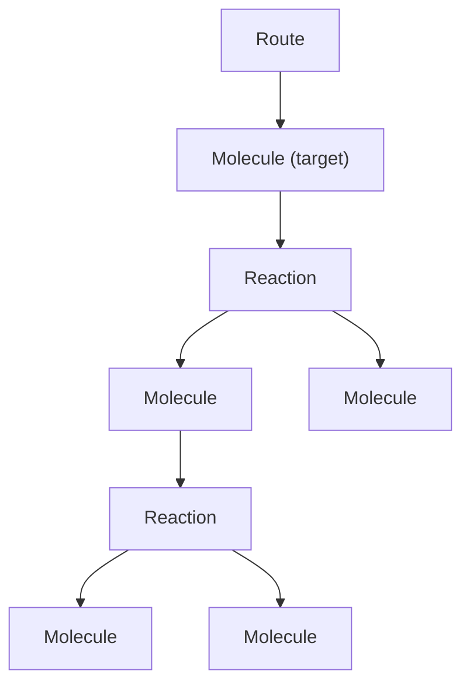
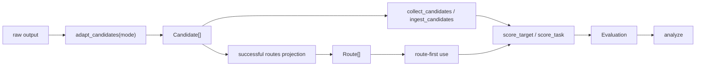

# Schema Design

This document captures the thinking process for the core data model and workflow design in RetroCast. It is a more elaborate version of the [concepts overview page](/concepts) and is the primary place to build a mental model of the codebase.

## Goals

RetroCast is designed to handle two broad use cases:

- casting arbitrary planner output into canonical `Route`s
- evaluating those outputs for one target or many targets

## Route

In RetroCast, a `Route` is an AND/OR tree of `Molecule` and `Reaction` nodes.

```text
Route -> Molecule -> Reaction -> Molecule -> Reaction -> ...
```



Basic schema

```python
class Molecule(BaseModel):
    smiles: SmilesStr
    inchikey: InchiKeyStr
    product_of: Reaction | None = None
    annotations: dict[str, Any] = Field(default_factory=dict)


class Reaction(BaseModel):
    reactants: list[Molecule]
    mapped_reaction_smiles: ReactionSmilesStr | None = None
    template: str | None = None
    reagents: list[SmilesStr] | None = None
    solvents: list[SmilesStr] | None = None
    annotations: dict[str, Any] = Field(default_factory=dict)


class Route(BaseModel):
    target: Molecule
    annotations: dict[str, Any] = Field(default_factory=dict)
    schema_version: str = "2"
```

Identical molecules in different positions (e.g. same building block used in two branches) are different nodes; whence a Route is a tree, not just a DAG. Primarily because enforcing a 1 molecule = 1 node would introduce operational (serialization, signatures) complexity without any clear/obvious benefit beyond just marginally smaller disk usage.

### Route path

RetroCast uses deterministic paths to refer to molecules and reactions inside a `Route`. The full grammar lives in [Route Node IDs](developers/route-node-ids); but here's a useful cheat sheet:

- `rc:m:/` root target molecule
- `rc:r:/` root reaction
- `rc:m:/0` first reactant under `rc:r:/`
- `rc:r:/0` reaction producing `rc:m:/0`
- `rc:m:/1/0` first child under `rc:m:/1`

these IDs are derived in memory and are not serialized. internally, they should be represented as typed addresses, not repeatedly parsed strings:

```python
class RoutePath(BaseModel):
    kind: Literal["m", "r"]
    indices: tuple[int, ...] = ()

    @classmethod
    def parse(cls, value: str) -> RoutePath: ...

    @classmethod
    def target(cls) -> RoutePath: ...

    @classmethod
    def root_reaction(cls) -> RoutePath: ...

    def id(self) -> str: ...
    def depth(self) -> int: ...

    def is_molecule(self) -> bool: ...
    def is_reaction(self) -> bool: ...

    def produced_by(self) -> RoutePath: ...
    def product(self) -> RoutePath: ...
    def reactant(self, index: int) -> RoutePath: ...
```

semantics:

- `RoutePath.target()` is `rc:m:/`
- `RoutePath.root_reaction()` is `rc:r:/`
- `RoutePath.parse("rc:m:/1/0").produced_by()` is `rc:r:/1/0`
- `RoutePath.parse("rc:r:/1/0").product()` is `rc:m:/1/0`
- `RoutePath.parse("rc:r:/1/0").reactant(2)` is `rc:m:/1/0/2`


## Route Signatures

`Route` signatures give us a canonical way to talk about route structure without carrying around the whole tree or comparing nested objects by hand. They are the basis for route comparison: full-route equality, reaction equality, prefix matching to depth `k`, and subtree containment. The core idea is [Merkle-like](https://en.wikipedia.org/wiki/Merkle_tree): the signature of a parent is built from its own identity plus the signatures of its children. Signatures are:

- order-invariant over reactant ordering
- preserve multiplicity when the same reactant appears more than once
- and can be parameterized by match level when needed. 

### Molecule Identity

We use [InChiKeys](https://en.wikipedia.org/wiki/International_Chemical_Identifier) as molecular identity. RetroCast currently supports three levels of InChiKey specificity:

- `retrocast.chem.InChIKeyLevel.FULL` - full 27-char InChIKey
- `retrocast.chem.InChIKeyLevel.NO_STEREO` - 27-char InChIKey generated without stereochemical information
- `retrocast.chem.InChIKeyLevel.CONNECTIVITY` - first 14 chars, connectivity layer only

Most users should use the default `FULL` level, but sometimes a model developer might wish to disambiguate planner's failure to account for proper stereochemistry from more fundamental failures to find the right connectivity (wherefore he might use `NO_STEREO`). Or might want to ignore isotope/protonation differences (wherefore `CONNECTIVITY`).

```python
class Molecule(BaseModel):
    ...

    def key(self, match_level: InChIKeyLevel = InChIKeyLevel.FULL) -> str:
        return reduce_inchikey(self.inchikey, match_level)
    def signature(self, match_level: InChIKeyLevel = InChIKeyLevel.FULL) -> str:
        return stable_hash(self.key(match_level))
```

### Reaction Identity

At the most basic structural level, a reaction identity is defined by the structures of reactants and product. Defining `key` and `signature` method on a `Reaction` class is not possible without having a pointer to the `Reaction` product. There are two options:

- treat `Reaction` as a Route-specific occurrence object (with an explicit pointer to its product), but that requires writing custom serialization logic and ensuring loaded Reaction objects are always "hydrated" with proper parent references. Violates the spirit of [SRP](https://en.wikipedia.org/wiki/Single-responsibility_principle) and I'm a bit WebDev-brained not to think of the Data-View split analogy, so instead
- we create a `ReactionView` model that provides a required route-contextual representation of a `Reaction`.

```python
class ReactionView:
    route: Route
    path: RoutePath
    value: Reaction

    def product(self) -> MoleculeView: ...
    def reactants(self) -> list[MoleculeView]: ...

    def key(self, match_level: InChIKeyLevel = InChIKeyLevel.FULL) -> tuple:
        return (
            "rxn",
            self.product().key(match_level),
            tuple(sorted(r.key(match_level) for r in self.reactants())),
        )

    def signature(self, match_level: InChIKeyLevel = InChIKeyLevel.FULL) -> str:
        return stable_hash(self.key(match_level))
```

for consistency in api design and ease of subtree comparison, we also define a similar view model for `Molecule`.

```python
class MoleculeView:
    route: Route
    path: RoutePath
    value: Molecule

    def key(self, match_level: InChIKeyLevel = InChIKeyLevel.FULL) -> str:
        return self.value.key(match_level)

    def produced_by(self) -> ReactionView | None: ...

    def subtree_key(self, match_level=InChIKeyLevel.FULL, *, depth=None):
        if self.value.product_of is None or depth == 0:
            return ("mol", self.key(match_level))

        next_depth = None if depth is None else depth - 1
        reaction = self.produced_by()
        child_sigs = sorted(
            reactant.subtree_signature(match_level, depth=next_depth)
            for reactant in reaction.reactants()
        )

        return (
            "mol",
            self.key(match_level),
            reaction.key(match_level),
            tuple(child_sigs),
        )

    def subtree_signature(self, match_level=InChIKeyLevel.FULL, *, depth=None):
        return stable_hash(self.subtree_key(match_level, depth=depth))
```


### Route Identity

With the primitives above, full route equality is established by the subtree signature of the target with unlimited depth. i.e. `route.signature()` is an alias for `route.molecule_at("rc:m:/").subtree_signature()`. A generic exact subtree equality is `route.molecule_at(path).subtree_signature()`.

We often might be interested in asking how far along the plan (starting from the target) do any two Routes agree? Such prefix matching is simply a subtree signature of fixed depth `k` rooted at the target.

```python
class Route(BaseModel):
    ...

    def key(
        self,
        match_level: InChIKeyLevel = InChIKeyLevel.FULL,
        *,
        depth: int | None = None,
    ) -> tuple:
        return self.target().subtree_key(match_level, depth=depth)

    def signature(
        self,
        match_level: InChIKeyLevel = InChIKeyLevel.FULL,
        *,
        depth: int | None = None,
    ) -> str:
        return stable_hash(self.key(match_level, depth=depth))
```

### Route Embedding

To be defined later, once we finish the basic migration. But a subtree signature primitive should simplify simple queries like "does a <- b <- c" contain "a <- b" queries. 


## workflow



## 1. adapt

adapt turns raw planner output into either:

- canonical `Route`s
- or ranked `Candidate`s that preserve failed slots

### adapt schemas

```python
AdaptMode = Literal["strict", "prune"]


class FailureRecord(BaseModel):
    code: str
    message: str | None = None
    target_id: str | None = None
    target_smiles: SmilesStr | None = None
    context: dict[str, Any] = Field(default_factory=dict)


class Candidate(BaseModel):
    rank: int
    route: Route | None = None
    failure: FailureRecord | None = None
```

rules:

- exactly one of `route` or `failure`
- adapter `cast(...)` returns only `Route`
- invalid smiles usually fail here, during casting / canonicalization
- failed candidates must carry target hints if later benchmark binding depends on them

why `Candidate` exists:

- it preserves original rank slots
- it preserves adaptation failures
- it gives scoring an honest denominator for tier-0

if the user does not care about failures, use routes directly.

why `FailureRecord` still exists:

- sometimes no trustworthy `Route` can be produced at all
- representing that as an "empty route" would introduce fake chemistry
- total failure is the only failure we preserve in the core schema

### adapt modes

`strict`:

- any chemistry error discards the whole route
- output is either a full `Route` or a total `FailureRecord`

`prune`:

- a local chemistry error drops the containing reaction subtree
- the valid prefix above it is kept
- the retained route now ends at that frontier

this is the right place for flexible adapt.

pruning does **not** mean the remaining prefix is chemically invalid. it means the plan is incomplete.

current code does not expose a structured partial-error contract for adapters. today the real seam is simpler:

- adapter returns a `Route`
- or adapter raises and adaptation records total failure

so if we add `prune` mode, it should still return an ordinary retained-prefix `Route`, not a route plus extra prune annotations in the core schema.

### adapt api

```python
adapt_route(raw_route, adapter, *, mode: AdaptMode = "strict") -> Route | None

adapt_routes(raw_output, adapter, *, mode: AdaptMode = "strict") -> list[Route]

adapt_candidates(raw_output, adapter, *, mode: AdaptMode = "strict") -> list[Candidate]
```

intended use:

- `adapt_routes(...)` for route-first inspection and ad hoc use
- `adapt_candidates(...)` for benchmarking and honest solv/tier metrics

important: these are not different chemistry conversions.

- `adapt_candidates(...)` is the full ranked adaptation result
- `adapt_routes(...)` is just the successful-route projection
- `adapt_route(...)` is the single-item version of that projection

this is the real meaning of the current `--preserve-failed-candidates` flag.

## 2. collect / ingest

collection maps adapted outputs onto known targets.

we use `collect` rather than `bind` here because that is already the project’s public vocabulary: adapter output is collected onto benchmark targets for scoring.

ingest is just the convenience workflow:

```text
adapt + collect + save
```

### collect schemas

```python
class Target(BaseModel):
    id: str
    smiles: SmilesStr
    acceptable_routes: list[Route] = Field(default_factory=list)
    annotations: dict[str, Any] = Field(default_factory=dict)


class Task(BaseModel):
    name: str
    targets: dict[str, Target]
    schema_version: str = "2"


CollectedCandidates = dict[str, list[Candidate]]
CollectedRoutes = dict[str, list[Route]]
```

one benchmark is a `Task`.

one daedalus query is also a `Task`, usually with one target.

for now, one target has one 1d acceptable-route list:

```python
acceptable_routes: list[Route]
```

not a list of route sets.

### collect api

```python
collect_candidates(
    candidates: Iterable[Candidate],
    task: Task,
) -> CollectedCandidates

collect_routes(
    routes: Iterable[Route],
    task: Task,
) -> CollectedRoutes
```

collection rules:

- if `candidate.route` exists, place it by `route.target`
- otherwise place it by `candidate.failure.target_id` / `candidate.failure.target_smiles`
- ambiguous and unmatched cases should be explicit policy decisions, not silent magic

these do the same conceptual operation over different row types:

- `collect_candidates(...)` preserves failed rank slots
- `collect_routes(...)` is the route-only projection

### ingest api

```python
ingest_routes(raw_output, adapter, task) -> CollectedRoutes

ingest_candidates(raw_output, adapter, task) -> CollectedCandidates
```

intended use:

- `ingest_routes(...)` when the user wants only valid canonical routes
- `ingest_candidates(...)` when the user wants an honest evaluation artifact

## 3. score

score is where solv-n and acceptable-route comparisons happen.

this is why we still need a post-score row. `Candidate` only says:

- what rank slot existed
- whether adaptation produced a route

scoring adds genuinely new facts:

- which tiers the route failed
- which reactions failed
- which scope constraints failed
- whether the route matches an acceptable route fully, at the root reaction, or only to some prefix depth

that post-score row should be called `ScoredCandidate`.

the earlier failures-only sketch was too spartan.

the right compromise is:

- keep explicit positive `status` on tier / route / scope results
- keep detailed per-check records sparse
- do not store giant lists of passing checks just to say "everything was fine"

### score inputs

scoring consumes:

- collected candidates
- a fixed tier taxonomy `0..3`
- one or more named scopes
- optional acceptable routes on the target

```python
Tier = Literal[0, 1, 2, 3]


class StockConstraint(BaseModel):
    type: Literal["stock"] = "stock"
    stock_name: str
    match_level: str = "full"


class RequiredLeafConstraint(BaseModel):
    type: Literal["required_leaf"] = "required_leaf"
    smiles: SmilesStr | None = None
    inchikey: InchiKeyStr | None = None
    match_level: str = "full"


Constraint = StockConstraint | RequiredLeafConstraint


class Scope(BaseModel):
    name: str
    constraints: list[Constraint] = Field(default_factory=list)
```

### validity schema

validity stores whether a route or reaction passed tier `n`, and why.

```python
CheckStatus = Literal["pass", "fail", "not_evaluated"]


class CheckResult(BaseModel):
    code: str
    status: CheckStatus = "fail"
    message: str | None = None
    details: dict[str, Any] = Field(default_factory=dict)


class TierResult(BaseModel):
    status: CheckStatus
    checks: list[CheckResult] = Field(default_factory=list)


class ReactionValidity(BaseModel):
    path: str
    tiers: dict[Tier, TierResult] = Field(default_factory=dict)


class RouteValidity(BaseModel):
    tiers: dict[Tier, TierResult] = Field(default_factory=dict)
    reactions: list[ReactionValidity] = Field(default_factory=list)


class ConstraintResult(BaseModel):
    status: CheckStatus
    checks: list[CheckResult] = Field(default_factory=list)
```

why `ConstraintResult` has both `status` and `checks`:

- `status` is the compact answer we query constantly
- `checks` are sparse explanations for why it failed
- empty `checks` must not ambiguously mean either "pass" or "not_evaluated"
- we do not want to emit fake passing checks just to preserve status

what we borrow from current [validity.py](/Users/morgunov/Developer/ischemist/synthesis-planning/project-procrustes/src/retrocast/models/validity.py:10):

- `CheckStatus`
- `TierResult(status, checks)`
- `ReactionValidity`
- `RouteValidity`
- `ConstraintResult(status, checks)`

what we do **not** carry over:

- legacy serializer / parser cruft for `"tier N"` keys
- `ScopeId = Literal["stock"]`
- global “implemented tier” machinery inside the schema layer

pass/fail is explicit:

- route passes tier `t` iff `validity.tiers[t].status == "pass"`
- reaction passes tier `t` iff the reaction's tier status is `"pass"`
- scope passes iff `scope_results[scope_name].status == "pass"`

### route comparison api

matching should not be a persisted schema in v1.

the carmack move is simpler:

- `Route` already knows how to derive subtree / reaction / prefix signatures
- comparisons are just comparisons of those signatures
- exact containment is an index lookup over subtree signatures
- embedded containment is a separate recursive algorithm built on top of the same route api
- if we ever need a richer persisted comparison contract later, add it later

examples:

```python
# full route match
candidate.same_subtree(reference)

# root reaction match
candidate.same_reaction(reference)

# branch-local subtree match
candidate.same_subtree(reference, path="rc:m:/1", other_path="rc:m:/1")

# branch-local prefix match to depth 3
candidate.same_prefix(reference, path="rc:m:/1", other_path="rc:m:/1", depth=3)

# does reference contain this candidate subtree anywhere?
reference.contains_subtree(candidate)

# where does the right branch of candidate occur inside reference?
reference.subtree_hit_paths(candidate, other_path="rc:m:/1")

# does reference contain this candidate route after pruning deeper host branches?
reference.contains_embedded_subtree(candidate)
```

for the branch-level example from [route-node-ids.md](/Users/morgunov/Developer/ischemist/synthesis-planning/project-procrustes/docs/developers/route-node-ids.md:1), this is the kind of query we want:

```python
candidate.same_prefix(reference, path="rc:m:/1", other_path="rc:m:/1", depth=3)
```

or, if you only care whether the whole right branch matches:

```python
candidate.same_subtree(reference, path="rc:m:1", other_path="rc:m:1")
```

### scored row schema

`ScoredCandidate` is the post-score row.

```python
class ScoredCandidate(BaseModel):
    rank: int
    route: Route | None = None
    failure: FailureRecord | None = None
    validity: RouteValidity = Field(default_factory=RouteValidity)
    scope_results: dict[str, ConstraintResult] = Field(default_factory=dict)


class TargetResult(BaseModel):
    target: Target
    candidates: list[ScoredCandidate] = Field(default_factory=list)


class Evaluation(BaseModel):
    task: Task | None = None
    scopes: list[Scope] = Field(default_factory=list)
    tiers: list[Tier] = Field(default_factory=lambda: [0, 1, 2, 3])
    targets: dict[str, TargetResult] = Field(default_factory=dict)
    schema_version: str = "2"
```

solv-n under scope `s` is:

```text
validity.tiers[n].status == "pass"
and
scope_results[s].status == "pass"
```

why keep both `failure` and `validity`:

- `failure` is adaptation-time information: no route was produced
- `validity` is score-time information: given a route, which tiers / reactions passed or failed

most route-comparison outputs should be derived because they depend on:

- which reference route or route set you compare against
- which route-local paths you anchor on
- whether you care about full, root-reaction, prefix, subtree, or containment semantics

for a failed adaptation slot:

- `route is None`
- `failure` is populated
- `validity.tiers[0].status == "fail"`
- higher tiers can be `"not_evaluated"`

### tier-0 model

the intended tier-0 logic is:

- a reaction fails tier-0 if product or any reactant is not a valid smiles
- a route fails tier-0 if any reaction fails tier-0
- a failed adaptation slot counts as tier-0 fail

important subtlety:

- for successful canonical routes, smiles validity is usually already guaranteed by adaptation
- in `prune` mode, invalid deeper reactions can be dropped while the remaining prefix still passes tier-0
- therefore the honest tier-0 denominator requires the candidate-preserving path, but incompleteness should not be conflated with invalidity

in other words, tier-0 is partly a scoring concern and partly an adaptation concern.

### termination / stock semantics

incomplete and invalid are different.

a pruned route can be:

- tier-0 valid on all surviving reactions
- even tier-3 valid on all surviving reactions
- but still not solvable

`stock` scope should therefore fail when either:

- some leaf is not in stock

that is how we prevent an incomplete plan from looking solved.

### score api

```python
score_target(
    target: Target,
    candidates: list[Candidate],
    *,
    scopes: list[Scope] | None = None,
    tiers: Sequence[Tier] = (0, 1, 2, 3),
) -> TargetResult

score_task(
    task: Task,
    collected_candidates: CollectedCandidates,
    *,
    scopes: list[Scope] | None = None,
    tiers: Sequence[Tier] = (0, 1, 2, 3),
) -> Evaluation
```

`score_target(...)` is the primitive.

`score_task(...)` is the benchmark wrapper.

helper methods that belong on `ScoredCandidate`:

```python
scored.tier_passes(tier: Tier) -> bool
scored.scope_passes(scope: str) -> bool
scored.solv(tier: Tier, scope: str) -> bool
```

route-comparison helpers should live on `Route`, not inside `ScoredCandidate`.

examples:

```python
# single target
candidates = adapt_candidates(raw_output, adapter)

result = score_target(
    Target(id="query-1", smiles=query_smiles),
    candidates,
    scopes=[Scope(name="stock", constraints=[StockConstraint(stock_name="emolecules")])],
)
```

```python
# benchmark
collected = ingest_candidates(raw_output, adapter, task)

evaluation = score_task(
    task,
    collected,
    scopes=[Scope(name="stock", constraints=[StockConstraint(stock_name="emolecules")])],
)
```

## 4. analyze

analyze should derive benchmark-style metrics from `Evaluation`.

these should be derived here, not permanently stored in `TargetResult`:

- first valid rank by tier
- first solv rank by tier and scope
- first full-match rank
- first root-reaction-match rank
- mean / median best prefix depth
- any top-k metric

### analyze schema

```python
class MetricSummary(BaseModel):
    value: float
    ci_low: float | None = None
    ci_high: float | None = None


class AnalysisReport(BaseModel):
    metrics: dict[str, MetricSummary] = Field(default_factory=dict)
    by_stratum: dict[str, dict[str, MetricSummary]] = Field(default_factory=dict)
```

### analyze api

```python
analyze(
    evaluation: Evaluation,
    *,
    ks: Sequence[int] = (1, 5, 10, 50),
    stratify_by: Callable[[TargetResult], str | None] | None = None,
) -> AnalysisReport
```

examples of analysis metrics we should support natively:

- `solv_0@k`, `solv_1@k`, `solv_2@k`, `solv_3@k`
- `full_match@k`
- `root_reaction_match@k`
- `mean_best_prefix_depth`
- `mean_best_prefix_fraction`

## recommended persisted artifacts

- route-first artifact: bound `Route`s only
- candidate artifact: bound `Candidate`s with failed slots preserved
- evaluation artifact: `Evaluation`
- analysis artifact: `AnalysisReport`

## migration notes

- keep reading v1 artifacts via upgraders
- add `schema_version` to route, task, evaluation, and analysis artifacts
- stop serializing derived/computed route fields
- move summary ranks and benchmark-only stratification out of score artifacts
