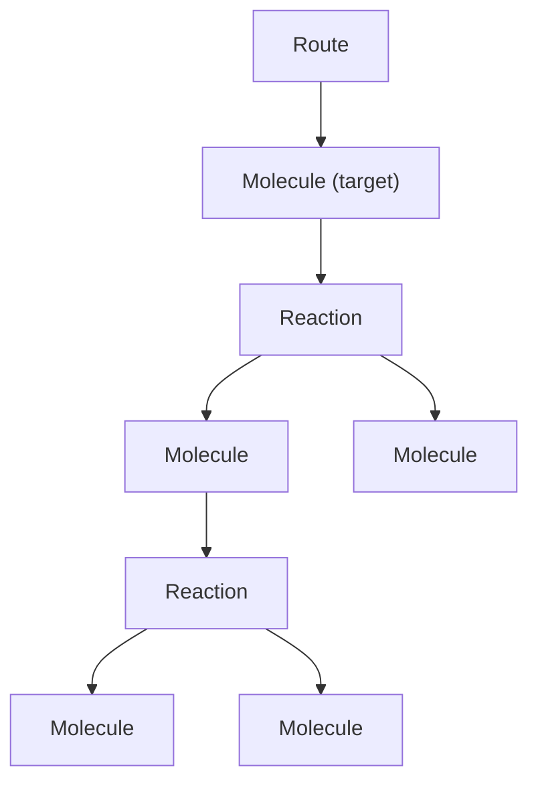
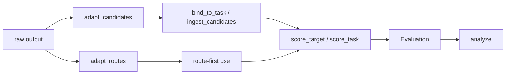

# design doc

## goals

retrocast should expose 2 clean primitives:

- cast arbitrary planner output into canonical `Route`s
- evaluate ranked outputs for one target or many targets

benchmark evaluation is a wrapper around the single-target primitive, not the other way around.

## principles

- keep the data model small
- keep the data flow explicit
- store structural facts, derive summaries
- route-first where possible
- preserve failed candidates only when the workflow needs an honest denominator

## core names

- `Route`
- `Molecule`
- `Reaction`
- `FailureRecord`
- `Candidate`
- `Target`
- `Task`
- `Scope`
- `ScoredCandidate`
- `TargetResult`
- `Evaluation`
- `AnalysisReport`

## route

`Route` stays a strict rooted tree.

```text
Route -> Molecule -> Reaction -> Molecule -> Reaction -> ...
```

not:

```text
Route -> Route -> Route
```



### route schema

```python
class Molecule(BaseModel):
    smiles: SmilesStr
    inchikey: InchiKeyStr
    reaction: Reaction | None = None
    annotations: dict[str, Any] = Field(default_factory=dict)


class Reaction(BaseModel):
    reactants: list[Molecule]
    mapped_smiles: ReactionSmilesStr | None = None
    template: str | None = None
    reagents: list[SmilesStr] | None = None
    solvents: list[SmilesStr] | None = None
    annotations: dict[str, Any] = Field(default_factory=dict)


class Route(BaseModel):
    target: Molecule
    annotations: dict[str, Any] = Field(default_factory=dict)
    schema_version: str = "2"
```

### route semantics

- `Molecule` is a positioned occurrence in one route, not a pure identity object
- no custom `__eq__` / `__hash__` by inchikey
- identical molecules in different positions are different nodes
- chemical identity is compared explicitly via `molecule.key(...)`

derived route-local ids:

- `m:_` root target molecule
- `r:_` root reaction
- `m:0` first reactant under `r:_`
- `r:0` reaction producing `m:0`
- `m:1.0` first child under `m:1`

derived in memory, never serialized:

```python
route.node_index: dict[str, Molecule]
route.reaction_index: dict[str, Reaction]
route.subtree_signature_by_path: dict[str, str]
route.reaction_signature_by_path: dict[str, str]
route.prefix_signature_by_depth: dict[int, str]
```

signature rules:

- order-invariant over reactant ordering
- multiplicity-preserving for duplicate reactants
- parameterized by match level when needed
- never use `frozenset(...)`

### route api

```python
route.length() -> int
route.leaves(unique: bool = True) -> list[Molecule]
route.root_reaction() -> Reaction | None

route.subroute(path: str) -> Route
route.prefix(depth: int) -> Route
route.iter_subroutes() -> Iterator[Route]

route.subtree_signature(path: str, *, match_level=...) -> str
route.reaction_signature(path: str, *, match_level=...) -> str
route.prefix_signature(depth: int, *, match_level=...) -> str

route.matches(other: Route, *, mode: Literal["full", "root_reaction", "prefix"], depth: int | None = None) -> bool
route.max_prefix_depth(other: Route, *, match_level=...) -> int
route.contains_subroute(other: Route, *, match_level=...) -> bool
```

this is enough for:

- full acceptable-route match
- root reaction match
- depth-`k` prefix match
- mean / max matched depth
- subroute containment

## workflow



## 1. adapt

adapt turns raw planner output into either:

- canonical `Route`s
- or ranked `Candidate`s that preserve failed slots

### adapt schemas

```python
AdaptMode = Literal["strict", "prune"]


class FailureRecord(BaseModel):
    code: str
    message: str | None = None
    target_id: str | None = None
    target_smiles: SmilesStr | None = None
    context: dict[str, Any] = Field(default_factory=dict)


class AdaptIssue(BaseModel):
    path: str | None = None
    code: str
    message: str | None = None
    context: dict[str, Any] = Field(default_factory=dict)


class Candidate(BaseModel):
    rank: int
    route: Route | None = None
    failure: FailureRecord | None = None
    adapt_issues: list[AdaptIssue] = Field(default_factory=list)
    open_leaf_paths: list[str] = Field(default_factory=list)
```

rules:

- exactly one of `route` or `failure`
- adapter `cast(...)` returns only `Route`
- invalid smiles usually fail here, during casting / canonicalization
- failed candidates must carry target hints if later benchmark binding depends on them
- `adapt_issues` are for local recoverable adapt problems
- `open_leaf_paths` mark leaves created by pruning, i.e. incomplete plan frontiers

why `Candidate` exists:

- it preserves original rank slots
- it preserves adaptation failures
- it gives scoring an honest denominator for tier-0

if the user does not care about failures, use routes directly.

### adapt modes

`strict`:

- any chemistry error discards the whole route
- output is either a full `Route` or a total `FailureRecord`

`prune`:

- a local chemistry error drops the containing reaction subtree
- the valid prefix above it is kept
- an `AdaptIssue` is recorded
- the product of the dropped reaction becomes an open leaf

this is the right place for flexible adapt.

pruning does **not** mean the remaining prefix is chemically invalid.
it means the plan is incomplete.

### adapt api

```python
adapt_route(raw_route, adapter, *, mode: AdaptMode = "strict") -> Route | None

adapt_routes(raw_output, adapter, *, mode: AdaptMode = "strict") -> list[Route]

adapt_candidates(raw_output, adapter, *, mode: AdaptMode = "strict") -> list[Candidate]
```

intended use:

- `adapt_routes(...)` for route-first inspection and ad hoc use
- `adapt_candidates(...)` for benchmarking and honest solv/tier metrics

this is the real meaning of the current `--preserve-failed-candidates` flag.

## 2. collect / ingest

collect binds adapted outputs onto known targets.

ingest is just the convenience workflow:

```text
adapt + collect + save
```

### collect schemas

```python
class Target(BaseModel):
    id: str
    smiles: SmilesStr
    acceptable_routes: list[Route] = Field(default_factory=list)
    annotations: dict[str, Any] = Field(default_factory=dict)


class Task(BaseModel):
    name: str
    targets: dict[str, Target]
    schema_version: str = "2"


BoundCandidates = dict[str, list[Candidate]]
BoundRoutes = dict[str, list[Route]]
```

one benchmark is a `Task`.

one daedalus query is also a `Task`, usually with one target.

for now, one target has one 1d acceptable-route list:

```python
acceptable_routes: list[Route]
```

not a list of route sets.

### collect api

```python
bind_to_task(
    candidates: Iterable[Candidate],
    task: Task,
) -> BoundCandidates

collect_routes(
    routes: Iterable[Route],
    task: Task,
) -> BoundRoutes
```

binding rules:

- if `candidate.route` exists, bind by `route.target`
- otherwise bind by `candidate.failure.target_id` / `candidate.failure.target_smiles`
- ambiguous and unmatched cases should be explicit policy decisions, not silent magic

### ingest api

```python
ingest_routes(raw_output, adapter, task) -> BoundRoutes

ingest_candidates(raw_output, adapter, task) -> BoundCandidates
```

intended use:

- `ingest_routes(...)` when the user wants only valid canonical routes
- `ingest_candidates(...)` when the user wants an honest evaluation artifact

## 3. score

score is where solv-n and acceptable-route comparisons happen.

this is why we still need a post-score row. `Candidate` only says:

- what rank slot existed
- whether adaptation produced a route

scoring adds genuinely new facts:

- which tiers the route failed
- which reactions failed
- which scope constraints failed
- whether the route matches an acceptable route fully, at the root reaction, or only to some prefix depth

that post-score row should be called `ScoredCandidate`.

the earlier failures-only sketch was too spartan.

the right compromise is:

- keep explicit positive `status` on tier / route / scope results
- keep detailed per-check records sparse
- do not store giant lists of passing checks just to say "everything was fine"

### score schemas

```python
Tier = Literal[0, 1, 2, 3]
CheckStatus = Literal["pass", "fail", "not_evaluated"]


class StockConstraint(BaseModel):
    type: Literal["stock"] = "stock"
    stock_name: str
    match_level: str = "full"


class RequiredLeafConstraint(BaseModel):
    type: Literal["required_leaf"] = "required_leaf"
    smiles: SmilesStr | None = None
    inchikey: InchiKeyStr | None = None
    match_level: str = "full"


Constraint = StockConstraint | RequiredLeafConstraint


class Scope(BaseModel):
    name: str
    constraints: list[Constraint] = Field(default_factory=list)


class CheckResult(BaseModel):
    code: str
    status: CheckStatus = "fail"
    message: str | None = None
    details: dict[str, Any] = Field(default_factory=dict)


class TierResult(BaseModel):
    status: CheckStatus
    checks: list[CheckResult] = Field(default_factory=list)


class ReactionValidity(BaseModel):
    path: str
    tiers: dict[Tier, TierResult] = Field(default_factory=dict)


class RouteValidity(BaseModel):
    tiers: dict[Tier, TierResult] = Field(default_factory=dict)
    reactions: list[ReactionValidity] = Field(default_factory=list)


class ConstraintResult(BaseModel):
    status: CheckStatus
    checks: list[CheckResult] = Field(default_factory=list)


class MatchResult(BaseModel):
    full_match_index: int | None = None
    root_reaction_match: bool = False
    best_prefix_depth: int | None = None


class ScoredCandidate(BaseModel):
    rank: int
    route: Route | None = None
    failure: FailureRecord | None = None
    adapt_issues: list[AdaptIssue] = Field(default_factory=list)
    open_leaf_paths: list[str] = Field(default_factory=list)
    validity: RouteValidity = Field(default_factory=RouteValidity)
    scope_results: dict[str, ConstraintResult] = Field(default_factory=dict)
    match: MatchResult | None = None


class TargetResult(BaseModel):
    target: Target
    candidates: list[ScoredCandidate] = Field(default_factory=list)


class Evaluation(BaseModel):
    task: Task | None = None
    scopes: list[Scope] = Field(default_factory=list)
    tiers: list[Tier] = Field(default_factory=lambda: [0, 1, 2, 3])
    targets: dict[str, TargetResult] = Field(default_factory=dict)
    schema_version: str = "2"
```

what we borrow from current [validity.py](/Users/morgunov/Developer/ischemist/synthesis-planning/project-procrustes/src/retrocast/models/validity.py:10):

- `CheckStatus`
- `TierResult(status, checks)`
- `ReactionValidity`
- `RouteValidity`
- `ConstraintResult(status, checks)`

what we do **not** carry over:

- legacy serializer / parser cruft for `"tier N"` keys
- `ScopeId = Literal["stock"]`
- global “implemented tier” machinery inside the schema layer

pass/fail is now explicit:

- route passes tier `t` iff `validity.tiers[t].status == "pass"`
- reaction passes tier `t` iff the reaction's tier status is `"pass"`
- scope passes iff `scope_results[scope_name].status == "pass"`

solv-n under scope `s` is:

```text
validity.tiers[n].status == "pass"
and
scope_results[s].status == "pass"
```

why keep both `failure` and `validity`:

- `failure` is adaptation-time information: no route was produced
- `validity` is score-time information: given a route, which tiers / reactions passed or failed

why keep `adapt_issues` and `open_leaf_paths`:

- they record local pruning without pretending the surviving prefix is invalid
- they let scoring distinguish "chemically valid prefix" from "complete plan"

for a failed adaptation slot:

- `route is None`
- `failure` is populated
- `validity.tiers[0].status == "fail"`
- higher tiers can be `"not_evaluated"`

### tier-0 model

the intended tier-0 logic is:

- a reaction fails tier-0 if product or any reactant is not a valid smiles
- a route fails tier-0 if any reaction fails tier-0
- a failed adaptation slot counts as tier-0 fail

important subtlety:

- for successful canonical routes, smiles validity is usually already guaranteed by adaptation
- in `prune` mode, invalid deeper reactions can be dropped while the remaining prefix still passes tier-0
- therefore the honest tier-0 denominator requires the candidate-preserving path, but incompleteness should not be conflated with invalidity

in other words, tier-0 is partly a scoring concern and partly an adaptation concern.

### termination / stock semantics

incomplete and invalid are different.

a pruned route can be:

- tier-0 valid on all surviving reactions
- even tier-3 valid on all surviving reactions
- but still not solvable

`stock` scope should therefore fail when either:

- some leaf is not in stock
- or `open_leaf_paths` is non-empty

that is how we prevent pruning from laundering an incomplete plan into a solved one.

### score api

```python
score_target(
    target: Target,
    candidates: list[Candidate],
    *,
    scopes: list[Scope] | None = None,
    tiers: Sequence[Tier] = (0, 1, 2, 3),
) -> TargetResult

score_task(
    task: Task,
    bound_candidates: BoundCandidates,
    *,
    scopes: list[Scope] | None = None,
    tiers: Sequence[Tier] = (0, 1, 2, 3),
) -> Evaluation
```

`score_target(...)` is the primitive.

`score_task(...)` is the benchmark wrapper.

helper methods that belong on `ScoredCandidate`:

```python
scored.tier_passes(tier: Tier) -> bool
scored.scope_passes(scope: str) -> bool
scored.solv(tier: Tier, scope: str) -> bool
```

examples:

```python
# single target
candidates = adapt_candidates(raw_output, adapter)

result = score_target(
    Target(id="query-1", smiles=query_smiles),
    candidates,
    scopes=[Scope(name="stock", constraints=[StockConstraint(stock_name="emolecules")])],
)
```

```python
# benchmark
bound = ingest_candidates(raw_output, adapter, task)

evaluation = score_task(
    task,
    bound,
    scopes=[Scope(name="stock", constraints=[StockConstraint(stock_name="emolecules")])],
)
```

## 4. analyze

analyze should derive benchmark-style metrics from `Evaluation`.

these should be derived here, not permanently stored in `TargetResult`:

- first valid rank by tier
- first solv rank by tier and scope
- first full-match rank
- first root-reaction-match rank
- mean / median best prefix depth
- any top-k metric

### analyze schema

```python
class MetricSummary(BaseModel):
    value: float
    ci_low: float | None = None
    ci_high: float | None = None


class AnalysisReport(BaseModel):
    metrics: dict[str, MetricSummary] = Field(default_factory=dict)
    by_stratum: dict[str, dict[str, MetricSummary]] = Field(default_factory=dict)
```

### analyze api

```python
analyze(
    evaluation: Evaluation,
    *,
    ks: Sequence[int] = (1, 5, 10, 50),
    stratify_by: Callable[[TargetResult], str | None] | None = None,
) -> AnalysisReport
```

examples of analysis metrics we should support natively:

- `solv_0@k`, `solv_1@k`, `solv_2@k`, `solv_3@k`
- `full_match@k`
- `root_reaction_match@k`
- `mean_best_prefix_depth`
- `mean_best_prefix_fraction`

## recommended persisted artifacts

- route-first artifact: bound `Route`s only
- candidate artifact: bound `Candidate`s with failed slots preserved
- evaluation artifact: `Evaluation`
- analysis artifact: `AnalysisReport`

## migration notes

- keep reading v1 artifacts via upgraders
- add `schema_version` to route, task, evaluation, and analysis artifacts
- stop serializing derived/computed route fields
- move summary ranks and benchmark-only stratification out of score artifacts
